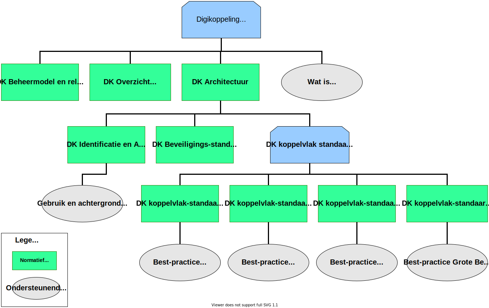

# Doel van dit document en leeswijzer

## Inleiding

Digikoppeling is een standaard voor gestructureerde gegevensuitwisseling waarmee overheden op een veilige manier gegevens met elkaar kunnen uitwisselen.

## Doel

De *Digikoppeling Architectuur* definieert de kaders – de gehanteerde principes en voorschriften - waarbinnen de gegevensuitwisseling op basis van Digikoppeling plaatsvindt en beschrijft de rol van intermediairs in de keten van gestructureerde gegevensuitwisseling.

## Doelgroep

De *Digikoppeling Architectuur* is bedoeld voor ICT-professionals in de publieke sector en voor ICT-leveranciers die Digikoppeling (willen gaan) gebruiken. Zie ook onderstaande tabel.

| Afkorting | Rol | Taak  | Doelgroep? |
| --------- | --- | --- | ------------ |
| [M]       | Management                      | Bevoegdheid om namens organisatie (strategische) besluiten te nemen.                                      | Nee    |
| [P]       | Projectleiding                  | Verzorgen van de aansturing van projecten.                                                                | Nee    |
| [A&D]     | Analyseren & ontwerpen (design) | Analyseren en ontwerpen van oplossings-richtingen. Het verbinden van Business aan de IT.                  | Ja     |
| [OT&B]    | Ontwikkelen, testen en beheer   | Ontwikkelt, bouwt en configureert de techniek conform specificaties. Zorgen voor beheer na ingebruikname. | Ja     |

Tabel 1.1: Doelgroep Digikoppeling Architectuur 

## Verantwoording

De *Digikoppeling Architectuur* is tot stand gekomen in samenwerking met leden van het Technisch Overleg Digikoppeling en andere belanghebbenden.

De *Digikoppeling Architectuur* is mede gebaseerd op:

- De *Digikoppeling-koppelvlakstandaarden.* Onderdelen uit deze documenten zijn hier samengevat om voor de lezer duidelijk te maken.

- Het *hoofdstuk over de Digikoppeling* keten bevat elementen *uit De Architectuurschets*, de context voor gegevensuitwisseling binnen de overheid in algemene zin en voor Digikoppeling in het bijzonder. *De Architectuurschets* is een tijdelijk product; de essentiële elementen van *De Architectuurschets* worden opgenomen in het *NORA Katern Verbinden*.

De architectuur van Digikoppeling wordt regelmatig geactualiseerd om goed te blijven aansluiten op de behoeften van overheden en de wensen van de maatschappij.

## Digikoppeling standaarden

De *Architectuur Digikoppeling* is onderdeel van de Digikoppeling-standaarden.
De documentatie is als volgt opgebouwd:

    
 Tekstalternatief 

<h2>Digikoppeling</h2>

Logius beheert Digikoppeling. De standaard bestaat uit beheermodel, een overzicht van actuele documentatie en de Digikoppeling architectuur. De architectuur omvat documentatie over identificatie en authorisatie, beveiligingsstandaarden en de koppelvlak standaarden. De koppelvlak standaarden bestaat uit API, WUS (SOAP) en ebMS standaarden met daarnaast een standaard voor grote berichten. Onderstaande documenten vormen samen de Digikoppeling standaard.

<h3>Normatieve documenten</h3>
<ul>
  <li>
    <a href="https://publicatie.centrumvoorstandaarden.nl/dk/actueel/">Digikoppeling Overzicht Actuele Documentatie en voorschriften</a>
  </li>
    <li>
    <a href="https://publicatie.centrumvoorstandaarden.nl/dk/architectuur">Digikoppeling Architectuur</a> Dit is de huidige versie.
  </li>
  <ul>
    <li>
      <a href="https://publicatie.centrumvoorstandaarden.nl/dk/beveilig/">Digikoppeling Beveiligingsstandaarden en voorschriften</a>
    </li>
    <li>
      <a href="https://publicatie.centrumvoorstandaarden.nl/dk/idauth/">Digikoppeling Identificatie en Authenticatie</a>
    </li>
    <li>Koppelvlakstandaarden:</li>
    <ul>
      <li>
        <a href="https://publicatie.centrumvoorstandaarden.nl/dk/ebms/">Digikoppeling Koppelvlakstandaard ebMS2</a>
      </li>
      <li>
        <a href="https://publicatie.centrumvoorstandaarden.nl/dk/wus/">Digikoppeling Koppelvlakstandaard WUS</a>
      </li>
      <li>
        <a href="https://publicatie.centrumvoorstandaarden.nl/dk/gb/">Digikoppeling Koppelvlakstandaard Grote Berichten</a>
      </li>
    </ul>
  </ul>
  <li>
    <a href="https://publicatie.centrumvoorstandaarden.nl/dk/beheer/">Digikoppeling Beheermodel</a>
  </li>
</ul>
<h3>Ondersteunende documenten (niet normatief)</h3>
<ul>
  <li>
    <a href="https://publicatie.centrumvoorstandaarden.nl/dk/watisdk/">Wat is Digikoppeling?</a>
  </li>
  <li>
    <a href="https://publicatie.centrumvoorstandaarden.nl/dk/bpebms">Digikoppeling Best Practices ebMS2</a>
  </li>
  <li>
    <a href="https://publicatie.centrumvoorstandaarden.nl/dk/bpwus">Digikoppeling Best Practices WUS</a>
  </li>
  <li>
    <a href="https://publicatie.centrumvoorstandaarden.nl/dk/bpgb">Digikoppeling Best Practices Grote Berichten</a>
  </li>
  <li>
    <a href="https://publicatie.centrumvoorstandaarden.nl/dk/gbachtcert/">Digikoppeling Gebruik en Achtergronden Certificaten</a>
  </li>
  </ul>

- Alle groene documenten vallen onder het beheer zoals geformaliseerd in het [[?Digikoppeling Beheermodel]].

- Een overzicht van alle Digikoppeling documentatie is opgenomen in *Bijlage A: Bronnen.*

- Alle goedgekeurde documenten zijn te vinden op de website van Logius, [www.logius.nl/digikoppeling](http://www.logius.nl/digikoppeling).

## Begrippen

Belangrijke begrippen en afkortingen zijn opgenomen in *Bijlage B: Begrippen*.
