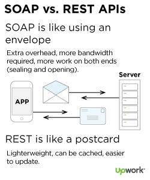
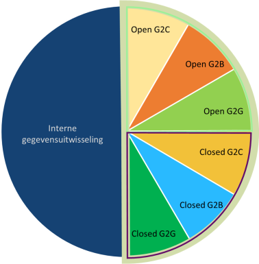
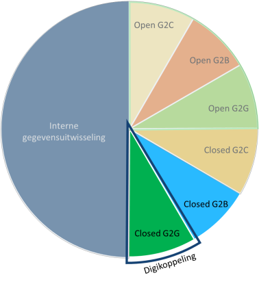
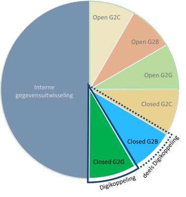

# Wat is Digikoppeling

In dit hoofdstuk opzet beschrijven we de belangrijkste facetten van de nieuwe Digikoppeling Architectuur.

## Doel van Digikoppeling

(Overheids)organisaties willen diensten klantgericht, efficiënt, flexibel en rechtmatig aanbieden aan burgers en bedrijven. Daarvoor moeten zij gegevens en documenten op een generieke manier met elkaar kunnen uitwisselen.

Digikoppeling voorziet hierin door de standaarden voor deze uitwisseling te definiëren. Met deze logistieke standaardisatie bevordert Digikoppeling de interoperabiliteit tussen (overheids)organisaties.

## Context van Digikoppeling

Voordat we inhoudelijk op Digikopeling en haar onderliggende standaarden en de hierbij horende toepassingsgebieden ingaan, is het belangrijk om aantal begrippen uit het gebied van gevensuitwisseling nader te beschrijven. Zeer belangrijk is ook het toepassings- en werkingsgebied te beschrijven waarmee Digikoppeling op de lijst van verplichte standaarden ('Pas-toe-of-leg-uit') van het Forum Standaardisatie vermeld staat. Met deze ingrediënten  formuleren  we uiteindelijk de scope van Digikoppeling.

### Open en Closed Data

Een belangrijke aanleiding voor het starten van de Commonground beweging van VNG was de ergernis over het op grote schaal rondpompen van gegevens binnen de digitale overheid. De ontsluiting van die gegevens en de noodzaak om die redundante bronnen synchroon te houden veroorzaakt een complex systeem van koppelingen. Een van de oplossingen voor het principe *Single Source of Truth* is om weer terug te gaan naar het concept van 'halen bij de bron', eigenlijk een van drijfveren van het ontstaan van het stelsel van basisregistraties.

Een concept dat sinds begin 2000 een opmars maakt is het principe van *Open Data*. Open Data zijn gegevens die in een open formaat door iedereen voor alle doeleinden vrij gebruikt, hergebruikt en gedeeld kunnen worden. De nadruk voor Open data ligt met name bij de gegevens van de overheid. Gegevens die om reden van privacy, veiligheid, wettelijke verplichtingen en dergelijk niet onder de definitie vallen noemen we in dit document Close Data.

### Open en Closed Diensten

Naast het onderscheid tussen Open en Closed data is het ook van belang om onderscheid te maken in publieke en afgeschermde diensten. Voor Closed Data biedt een overheidsorganisatie afgeschermde, beperkt toegankelijke closed diensten.

Een bron van open data kan een overheidsorganisatie aanbieden via een voor iedereen toegankelijke open dienst. Die bron kan echter essentieel zijn voor bepaalde publieke ketens. De aanbieder kan er voor kiezen om  naast een publieke dienst ook een beperkt toegankelijke dienst te aan te bieden, bijvoorbeeld met een uitgebreide beschikbaarheid, schaalbaarheid of functionaliteit.

- Open Diensten: diensten zonder toegangsbeperking bijvoorbeeld open data.
- Gesloten Diensten: diensten met toegangsbeperking bijvoorbeeld persoonsgegevens en vertrouwelijke gegevens of diensten voor specifieke partijen.

## Wanneer moet Digikoppeling toegepast worden

Digikoppeling staat op de lijst *verplichte standaarden* van het Forum Standaardisatie. De lijst beschrijft het *Functioneel* toepassingsgebied en het *organisatorisch* werkingsgebied. Met het functioneel toepassingsgebied bedoelt het Forum de toepassing(en) waarvoor het gebruik van de standaard verplicht is of aanbevolen wordt.

## Functioneel toepassingsgebied

Het Forum Standaardisatie definieert het *functioneel toepassingsgebied* van Digikoppeling als volgt:

> Digikoppeling moet worden toegepast op alle digitale gegevensuitwisseling met behulp van gestructureerde berichten die plaatsvindt met voorzieningen die onderdeel zijn van de GDI, waaronder de basisregistraties, of die sector-overstijgend is. Geautomatiseerde gegevensuitwisseling tussen informatiesystemen op basis van NEN3610 is uitgesloten van het functioneel toepassingsgebied.

bron: [[Pas-toe-of-leg-uit]]

Daarnaast benoemt het Forum de organisaties waarvoor de verplichting geldt. Dit wordt het *organisatorische werkinggebied* genoemd. Het werkingsgebied is als volgt gedefinieerd:
## Organisatorisch werkingsgebied

> Nederlandse overheden (Rijk, provincies, gemeenten en waterschappen) en instellingen uit de (semi-) publieke sector.
> Uitgezonderd zijn: de uitwisseling van Geo-informatie (daarvoor bestaat NEN3610) en de gevallen waarin de aanbieder van gegevens vaststelt dat geen noodzaak bestaat om de afnemer van de gegevens te authenticeren.- Nederlandse overheden (Rijk, provincies, gemeenten en waterschappen) en instellingen uit de (semi-) publieke sector.

bron: [[Pas-toe-of-leg-uit]]
## Van *'uitwisseling van gestructureerde berichten'* naar *'gestructureerde gegevensuitwisseling'*

Digikoppeling heeft zich vanaf het begin van haar ontstaan gericht op het uitwisselen van berichten, en dan specifiek op op de 'envelop' van een bericht en  niet op de inhoud. Iedere organisatie die Digikoppeling gebruikt kon daarmee de postverzending onafhankelijk van de inhoud inrichten.

Met de toevoeging van het Digikoppeling REST API profiel komt de vergelijking met berichten in enveloppen in het gedrang. Envelop en bericht schuiven in elkaar, de metafoor van enveloppen en postverzending werkt niet meer in alle koppelvlakken van de standaard. Echter, het basisprincipe blijft bestaan: Digikoppeling bemoeit zich niet met de inhoud, Digikoppeling heeft *'Geen boodschap aan de boodschap'*.

bron: <a href="https://www.upwork.com/resources/soap-vs-rest-a-look-at-two-different-api-styles">https://www.upwork.com/resources/soap-vs-rest-a-look-at-two-different-api-styles</a>

Het Forum beschrijft dat Digikoppeling gaat over het uitwisselen van gestructureerde berichten. Voor het gebruik van REST API's moet het concept van *berichten* wel erg uitgerekt worden om in deze definitie te passen. Een synchrone JSON response kan als een bericht worden gezien, maar of ook de request die hieraan voorafging als een gestructureerde *bericht* kan worden gezien vergt enige creativiteit. De uitwisseling van gegevens via REST API's is daarentegen in ieder geval wel *gestructureerd*, alleen al omdat elke interactie via een  API volgens een protocol, of standaard verloopt, zoals http [[?rfc7230]], https [[?rfc2818]], OpenAPI Specification [[?openapi]] of de (API Design Rules) [[?API Design Rules]].

Voor Digikoppeling verleggen we daarom de focus van berichtverkeer naar het uitwisselen van gegevens. Vandaar dat we in het vervolg in dit document zullen spreken over gestructeerde *gegevensuitwisseling*, in plaats van gestructureerde berichtuitwisseling.

<!-- 
- https://restfulapi.net/json-vs-xml/, 
- https://www.datamation.com/big-data/structured-vs-unstructured-data/
- https://www.slideshare.net/ewolff/rest-vs-messaging-for-microservices 
-->

## Digikoppeling voor externe uitwisseling

Digikoppeling richt zich dus van oudsher primair op het uitwisselen van gegevens 'met behulp van gestructureerde berichten' en maakt (tot nu toe) geen duidelijk onderscheid tussen Open en Closed Data. Dit maakt het niet duidelijk wanneer Digikoppeling gebruikt moet worden. Reden om dit beter af te pellen en de scope van Digikoppeling eens langs een andere lat te leggen.

Digikoppeling is een standaard voor gegevensuitwisseling *tussen* organisaties, met voorzieningen die onderdeel zijn van de GDI, waaronder de basisregistraties, of die sector-overstijgend is.

## Digikoppeling voor Closed Data en Open Data via Closed diensten

Digikoppeling bestaat uit een verzameling standaarden voor elektronisch verkeer tussen overheidsorganisaties. Digikoppeling gaat dus om overheidsgegevens. Openbare informatie van de Rijksoverheid mag worden hergebruikt, bijvoorbeeld op websites en in applicaties. Dit is Open Data.

Overheidsgegevens zijn actief beschikbaar als open data voor hergebruik van derden. Behalve als er goede redenen zijn om dat niet te doen. In dat geval noemen we dit Closed Data.

## Wie communiceert met wie

Digikoppeling verplicht dat verzender en ontvanger elkaar kennen ([[Pas-toe-of-leg-uit]] _zie Digikoppeling, paragraaf 'Overig/Waarvoor geldt de verplichting_). Digikoppeling gaat over communicatie tussen de overheden (G2G) en niet over uitwisseling met burgers (G2C). De communicatie tussen overheid en het bedrijfsleven (G2B) is niet gestandaardiseerd. 

## Scope van Digikoppeling

Digikoppeling moet worden toegepast voor geautomatiseerde gegevensuitwisseling tussen informatiesystemen en is verplicht voor Nederlandse overheden (Rijk, provincies, gemeenten en waterschappen) en instellingen uit de (semi-)publieke sector. Digikoppeling moet worden toegepast wanneer gebruikt gemaakt wordt van Gesloten Diensten. Dat wil zeggen diensten waarbij er noodzaak is om de afnemer te authenticeren.

### Grijs gebied

De verplichting voor Digikoppeling geldt dus voor communicatie tussen overheden. De praktijk is dat voor communicatie met bedrijven vaak verplichtingen gelden die hun oorsprong hebben in Digikoppeling, zoals het gebruik van het OIN en PKIoverheidscertificaten, of zelfs geïnspireerd zijn op Digikoppeling zoals het Koppelvlak *WUS voor Bedrijven* van Digipoort.

