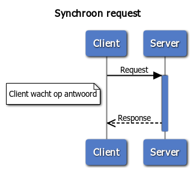
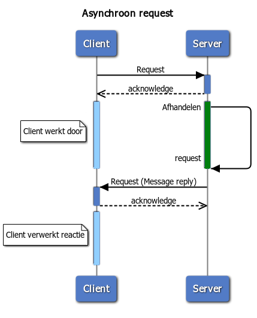
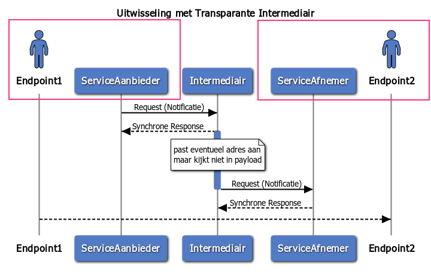
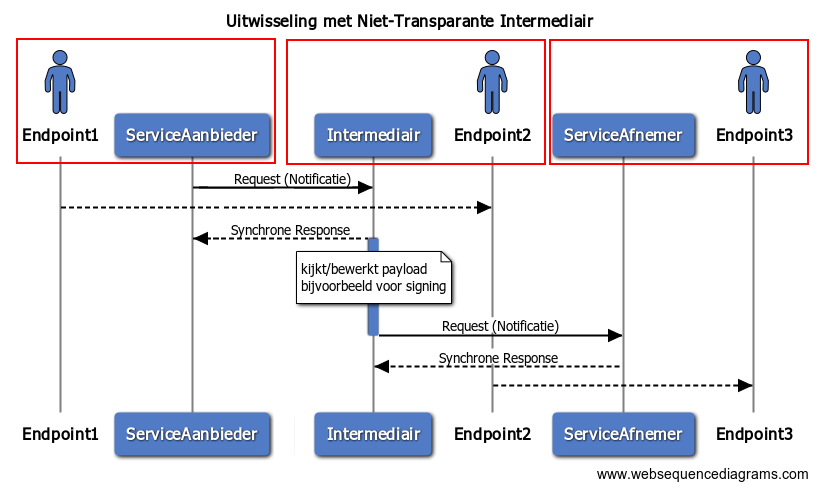

# Transactiepatronen in Digikoppeling

In dit hoofdstuk beschrijven we de transactiepatronen in gegevensuitwisseling in algemen zin, met een suggestie welk Digikoppeling koppelvlakstandaard hier het best bij aansluit. Voor het opstellen van de volgende transactiepatronen is dankbaar gebruik gemaakt van de conceptversie van de *Edukoppeling Architectuur 2.0*.  

### Synchrone bevraging

Bij een bevraging (vraag-antwoord) stuurt de service-requester een voorgedefinieerde vraag (request) aan de service-provider, die een antwoord (response) verstrekt. Het initiatief ligt bij de service-requester. Gaat er in de uitwisseling iets mis dan zal de service-requester na een bepaalde tijd de uitwisseling afbreken (time-out). Een synchrone bevraging is in de regel *idempotent*, een request kan opnieuw verstuurd worden zonder gevolgen. 

|Koppelvlakspecificatie|Omschrijving|Praktijkvoorbeeld|
|---|---|---|
|Digikoppeling WUS| Digikoppeling WUS is geschikt als voor de bevraging gestructureerde  berichten (in XML) nodig zijn. Digikoppeling heeft profielen voor signing en encryption. |...|
|Digikoppeling REST API| Digikoppeling REST API heet een GET methode waarmee synchrone requests kunnen uitgevoerd. Digikoppeling REST API kent nog geen gestandaardiseerde versies voor signing of encryptie| Bevragen OIN register via de COR API |

Tabel 5.1: Synchrone bevraging

### Synchrone Melding

Bij een melding-bevestiging stuurt een service-requester informatie naar de service-provider en de ontvangst wordt synchroon door de service-provider bevestigd. Belangrijk is de schadelijke effecten te voorkomen als een bericht twee keer wordt verzonden (door een time-out) of als meldingen in de verkeerde volgorde binnenkomen.

|Koppelvlakspecificatie|Omschrijving|Praktijkvoorbeeld|
|---|---|---|
|Digikoppeling WUS| Digikoppeling WUS is geschikt als voor de melding een gestructureerde bericht (in XML) nodig is. Digikoppeling heeft profielen voor signing en encryption. Voorwaarde is dat de melding *idempotent* is |...|
|Digikoppeling REST API| Digikoppeling REST API heet een PUT methode waarmee synchrone requests kunnen uitgevoerd. Digikoppeling REST API kent nog geen gestandaardiseerde versies voor signing of encryptie Het Digikoppeling REST API profiel kent ook een POST methode. POST is niet idempotent en kan dus niet herhaaldelijk worden verzonden| ... |

Tabel 5.2: Synchrone Melding

### Asynchrone Melding-bevestiging

Bij een melding-bevestiging stuurt een service-requester informatie naar de service-provider en ontvangt synchroon een bevestiging dat een bericht is ontvangen. op een later moment kan de ontvanger een bericht sturen dat de melding is verwerkt  

|Koppelvlakspecificatie|Omschrijving|Praktijkvoorbeeld|
|---|---|---|
|Digikoppeling ebMS2| Digikoppeling ebMS heeft reliable profiel (osb-rm) dat de bevestiging van ontvangst borgt | formele overdracht van OLO/DSO naar bevoegd gezag |
|Digikoppeling WUS| Digikoppeling WUS kent geen reliable profiel. Partijen in de keten moeten met elkaar afspraken hoe een melding wordt bevestigd in een antwoord door de ontvanger op een later tijdstip  |...|
|Digikoppeling REST API| Digikoppeling REST API heet een PUT en een POST methode waarmee synchrone requests kunnen uitgevoerd. Digikoppeling REST API kent geen reliable profiel. Partijen in de keten moeten met elkaar afspraken hoe een melding wordt bevestigd in een antwoord door de ontvanger op een later tijdstip| ... |

Tabel 5.3: Asynchrone Melding-bevestiging

### Uitwisselen grote bestanden

De situatie kan zich voordoen dat een bericht een omvang krijgt die niet meer efficiënt door de Digikoppeling-adapters verwerkt kan worden bijvoorbeeld vanwege de overhead bij eventuele hertransmissies. Ook kan het voorkomen dat er behoefte bestaat aan het sturen van aanvullende informatie naar systemen buiten de normale procesgang ('out-of-band').

|Koppelvlakspecificatie|Omschrijving|Praktijkvoorbeeld|
|---|---|---|
|Digikoppeling Grote berichten| Bij ‘grote berichten’ worden grotere bestanden uitgewisseld via een van de Digikoppeling profielen WUS, ebMS in combinatie met een (HTTPS-)download vanaf een beveiligde website. Grote berichten vormen een functionele uitbreiding op de Digikoppelvlakstandaarden voor de veilige bestandsoverdracht van berichten groter dan 20 MiB | ... |

Tabel 5.4: Uitwisselen grote bestanden

### Uitwisseling via een transparante intermediair

Een transparante keten is alleen mogelijk als zowel de service-aanbieder als de serviceafnemer hetzelfde protocol hanteren. De intermediair routeert berichten tussen de serviceaanbieder en de serviceafnemer waarbij het bericht intact blijft (alleen de header wordt gelezen). De uitwisseling verloopt op dezelfde manier als bij een bilaterale uitwisseling.

|Koppelvlakspecificatie|Omschrijving|Praktijkvoorbeeld|
|---|---|---|
|Digikoppeling WUS | Gebruik Digikoppeling WUS header voor routering  | ... |
|Digikoppeling ebMS | Gebruik Digikoppeling ebMS header voor routering| ... |

Tabel 5.5: Transparante intermediair

### Uitwisseling via een niet-transparante intermediair

Een transparante keten is alleen mogelijk als zowel de service-aanbieder als de serviceafnemer hetzelfde protocol hanteren. De intermediair routeert berichten tussen de serviceaanbieder en de serviceafnemer waarbij het bericht bewerkt moet worden voor verdere verzending. 

|Koppelvlakspecificatie|Omschrijving|Praktijkvoorbeeld|
|---|---|---|
|Digikoppeling WUS |Gebruik Digikoppeling WUS header voor routering| ... |
|Digikoppeling ebMS |Gebruik Digikoppeling ebMS header voor routering| ... |

Tabel 5.5: Niet-Transparante intermediair
