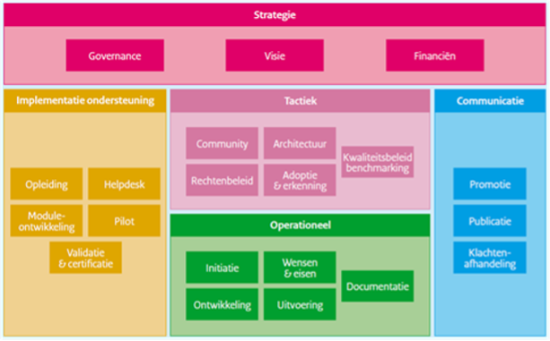
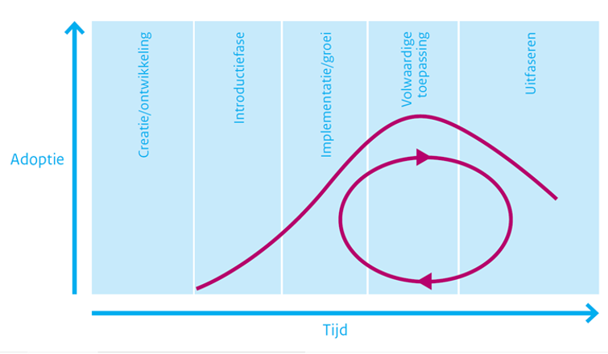
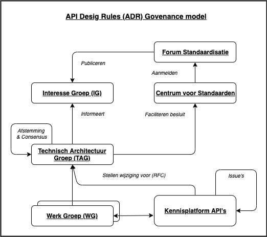

# 1. Inleiding

## leeswijzer

Dit document beschrijft hoe Logius, afdeling Standaarden (hierna: Logius) de REST-API Design Rules standaard beheert en hoe de bijbehorende governance is ingericht. In dit document wordt verder ADR gebruikt als afkorting voor de (REST)-API Design Rules.

## De REST-API Design Rules ofwel ADR-standaard

De ADR-standaard omvat een set van normatieve ontwerpafspraken voor het structureren en documenteren van REST-API’s. De standaard heeft tot doel om betere, uniforme en ontwikkelaar vriendelijke API’s te ontwikkelen die makkelijk te implementeren zijn.
De set van afspraken bestaat uit breed toepasbare en ondubbelzinnige richtlijnen. Deze helpen organisaties die nieuwe API’s ontwikkelen voor Nederlandse overheden (Rijk, provincies, gemeenten en waterschappen) en instellingen uit de (semi-) publieke sector.
Het Nut en de werking van de standaard zijn reeds goed beschreven door het Forum Standaardisatie en voor de eenduidigheid hieronder integraal opgenomen [zie link](https://www.forumstandaardisatie.nl/open-standaarden/rest-api-design-rules):

### Nut

> De overheid ontsluit gegevens en applicaties steeds vaker met REST-API's. Voorbeelden hiervan zijn te zien op de website [developer.overheid.nl](https://developer.overheid.nl), [in Common Ground](https://commonground.nl), [Haal Centraal](https://www.vngrealisatie.nl/producten/haal-centraal) en [het Digitaal Stelsel Omgevingswet](https://aandeslagmetdeomgevingswet.nl).  
> Representational state transfer (REST) is een ontwerpprincipe dat wereldwijd veel gebruikt wordt voor het bouwen van programmeerinterfaces over het web (API's). REST is geen standaard maar een ontwerpprincipe, en laat nog veel vrijheid in het structureren van API's.  
> De standaard REST-API Design Rules geeft een verzameling basisregels voor structuur en naamgeving waarmee de overheid op een uniforme en eenduidige manier REST-API's aanbiedt. Dit maakt het voor ontwikkelaars gemakkelijker om betrouwbare applicaties met te ontwikkelen met API's van de overheid.
> [Bron: Forum standaardisatie](https://www.forumstandaardisatie.nl/open-standaarden/rest-api-design-rules)

### Werking

> Een application programming interface (API) is een gestructureerd en gedocumenteerd koppelvlak voor communicatie tussen applicaties. Zo lang er computers zijn, bestaan er API's en worden er verschillende API technologieën gebruikt. In de laatste 10 jaar heeft Representational state transfer (REST) zich ontwikkeld tot een bepalend principe voor het realiseren van API's.  Zogenaamde ‘REST-API's’ doen voor applicaties wat websites voor mensen doen. Websites presenteren informatie aan mensen, REST-API's maken applicaties en gegevens over het Internet beschikbaar voor andere applicaties. De technologie achter websites en REST-API's heeft daarom veel gemeen.  
> De overheid gebruikt REST-API's voor koppelingen met andere overheden, bedrijven en indirect ook met burgers, bijvoorbeeld via mobiele apps en webapps die aangeboden worden door bedrijven of overheden zelf. Ontwikkelaars kunnen deze REST-API's bevragen vanuit de gangbare programmeertalen en frameworks zoals Python, Java, Microsoft C#, PHP.  
> [Bron: Forum standaardisatie](https://www.forumstandaardisatie.nl/open-standaarden/rest-api-design-rules)

### Status

De actuele versie van de ADR-standaard is 1.0. Deze versie is op 09-07-2020 door het OBDO vastgesteld op advies van het Forum Standaardisatie.   
De status van de ADR-standaard is ‘Verplicht (pas toe leg uit)’. Dit houdt kort gezegd in dat Nederlandse overheden en instellingen uit de (semi) publieke sector verplicht zijn deze standaard toe te passen op het moment dat zij REST API’s gaan gebruiken voor het ontsluiten van overheidsinformatie en/of functionaliteit. (Zie voor meer informatie over het [pas toe of leg uit beleid.](https://www.forumstandaardisatie.nl/node/229))   
- De verplichting is gepubliceerd door het Forum Standaardisatie op:  
https://www.forumstandaardisatie.nl/open-standaarden/rest-api-design-rules 
- Versie 1.0 van de ADR is gepubliceerd op:  
https://publicatie.centrumvoorstandaarden.nl/api/adr/1.0 
- De laatste versie van de ADR is gepubliceerd op:  
https://publicatie.centrumvoorstandaarden.nl/api/adr/ 
- De laatste concept versie van de standard is gepubliceerd op:  
https://logius-standaarden.github.io/API-Design-Rules/ 

## Bomos

Logius richt de beheerorganisatie in conform het Beheer en OntwikkelModel voor Open Standaarden (BOMOS). Ook het beheer van de ADR-standaard is op basis van BOMOS ingericht. Voor de beheerorganisatie heeft Logius een generiek beheermodel opgezet, waar het beheerplan van de ADR-standaard is afgeleid. 

> Figuur 1. Bomos model

Voor meer informatie over BOMOS zie ook [de beslisboom van het forumstandaardisatie](https://beslisboom.forumstandaardisatie.nl/thema/ontwikkelen-en-beheren-van-open-standaarden).  
BOMOS onderscheidt verschillende levenscyclusfases waarin een standaard zich kan bevinden. Deze fase bepaalt mede op welke beheeronderdelen meer of minder wordt ingezet. De verschillende fases zijn: 
1.	Creatie/ontwikkeling
2.	Introductie
3.	Implementatie/groei
4.	Volwaardige toepassing
5.	Uitfaseren

> Figuur 2. Bomos levenscyclus

De ADR-standaard bevindt zich in de implementatie/groei fase. De eerste versie standaard is 15-10-2019 aangemeld bij het Forum Standaardisatie en op 09-07-2020 op de lijst van verplichte standaarden opgenomen. Vanuit het Kennisplatform API’s en Logius Centrum voor Standaarden wordt momenteel nog volop aan de API Design Rules gewerkt en de verwachting is dat de standaard nog de nodige ontwikkelingen door gaat maken. Daarnaast komt het gebruik van de API Design Rules pas net op stoom, waardoor er van een volwaardige toepassing bij de beoogde doelgroep nog geen sprake is.  

Dit heeft gevolgen voor het beheer van de standaard. Naast de groei in de aantallen toepassingen van de standaard is ook relevant dat eerst nog minor en major wijzigingen in de standaard op een correcte manier worden doorgevoerd en er veel informatie beschikbaar is die gebruikers helpt bij de implementatie van de standaard. Daarom is er komende tijd vooral aandacht voor:
-	Het in de praktijk bestendigen van het beheer van de standaard; 
-	Gestaag doorontwikkeling van de specificaties zelf;
-	Bouwen en aanbieden ondersteunende tooling; 
-	Groei in het aantal toepassingen van de standaard;
-	Monitoring van het gebruik van de standaard;
-	Groei van de community rond de standaard.

# 2. Strategie

De strategische activiteiten van BOMOS bestaan uit de onderdelen Visie, Govenance en Financiering. Deze onderdelen en hun toepassing op het beheer van de ARD-standaard worden hieronder beschreven.

## Visie

Met de API Design Rules standaard wil de Nederlandse overheid interoperabiliteit bevorderen. Dit komt erop neer dat overheden dezelfde standaard in vergelijkbare situaties toepassen. Dit maakt uiteindelijk dat componenten en systemen onderling effectief gegevens uit kunnen wisselen. Zowel horizontaal in één voorziening binnen één situatie als vertikaal tussen voorzieningen in verschillende situaties en tussen organisaties. Deze doelstelling wordt onderschreven door een breed scala aan partijen die deelnemen aan het API Kennisplatform, waar de ontwikkeling van de standaard zijn oorsprong heeft, en is bestendigd door Forum Standaardisatie en het OverheidsBrede Beleidsoverhed Digitale Overheid (OBDO), die de ADR-standaard hebben opgenomen op de zogenaamde ‘pas toe of leg uit’-lijst met andere standaarden die interoperabiliteit bevorderen [zie ook de basisinformatie van het Forum Standaardisatie](https://www.forumstandaardisatie.nl/basisinformatie). 

## Governance

### Governancestructuur 

Bij het beheer van een open standaard hoort een open governance en een open procedure voor belanghebbenden om te kunnen participeren in het beheer. Logius, neemt hierin de rol van onafhankelijke, duurzame beheerpartij en facilitator. Bij het beheer van de ADR worden verschillende gremia onderscheiden die gezamenlijk invulling geven aan de governance op de standaard: 
1.	API-community (Interesse Groep - IG)  
Dit is het meest operationele gremium waarin iedere belangstellende/belanghebbende vragen kan stellen over de ADR-standaard en suggesties kan doen voor de doorontwikkeling van de standaard. Dergelijke vragen en suggesties worden door Logius verzameld en voorgelegd aan het Technisch Overleg en als issue geregistreerd bij de werkgroep ADR van het kennisplatform API’s.
2.	Technisch Overleg (Technische Architectuur Groep – TAG)  
Het Technisch Overleg is een periodieke bijeenkomst van de Technische Architectuur Groep (TAG) waarbij de vragen en doorontwikkelwensen m.b.t. de ADR worden doorgenomen, geprioriteerd en worden uitgewerkt. Daarnaast wordt door de leden de releaseplanning en de roadmap opgesteld. Deelname aan de TAG is vrij voor eenieder die een belang heeft bij de standaard (overheid, wetenschap en markt) 
3.	Tactisch overleg ADR  
Dit gremium is verantwoordelijk voor het vaststellen van de doorontwikkel-roadmap, het vaststellen van minor releases van de standaard en dient als het voorportaal van het strategisch/besluitvormende gremium: het OBDO.  
*N.B. Dit tactische gremium is momenteel nog niet actief, waardoor Logius bij wijzigingen aan de standaard, de nieuwe versie voorlegt aan het Forum Standaardisatie, voor het borgen van een zo breed mogelijke afstemming met verschillende belanghebbenden.*
4.	Het Overheidsbrede Beleidsoverleg Digitale Overheid (OBDO) 
Dit is het hoogst ambtelijke gremium dat besluit over major releases van de standaard, het beheermodel van de standaard en externe publicaties over releases en van het standaardenbeleid. Op dit moment wordt het OBDO louter ‘gevoed’ door Forum Standaardisatie en is de focus voornamelijk het bestendigen van major releases van de standaard. Op het moment dat het tactische gremium is ingevuld, zal het OBDO waarschijnlijk een breder scala aan onderwerpen langs krijgen ter bestendiging.  
*N.B. De definitieve invulling van de tactische en strategische laag wordt eind 2021 duidelijk*     

In tabelvorm: 
|**Gremium**|**Accent**|**Rol participant**|**Ondersteuning door beheerder (Logius)**|
|---|---|---|---|
|**API Community**   (omvang onbeperkt)|Inhoud – delen|1. Volgen van ontwikkelingen.   2. Leveren van input voor de doorontwikkeling van de standaard.|1. Informatie m.b.t. specificaties en beheer open delen met community.   2. Deelnemen aan  stuurgroep en werkgroepen van Kennisplatform API’s.| 
|**API Technisch Overleg**  (Operationeel, 4x per jaar)|Inhoud - afstemmen| Samen met andere experts:   1. Inhoudelijk ontwikkelen van standaard onderdelen en bijbehorende documentatie.   2. Voorbereiden van de release-planning.   3. Prioriteiten stellen voor de ontwikkeling, roadmap van nieuwe releases van de standaarden.   4. Goedkeuring van aanpassingen op de standaard.  |1. Analyseren, ontwerpen en uitwerken van specificaties.   2. Volgen en beïnvloeden van aanpalende standaarden.   3. Organiseren bijeenkomsten.   4. Opstellen en verspreiden notulen.  5. Beschikbaar stellen specificaties.
|**Tactisch/Strategisch**  (4x per jaar)|Prioritering proces en uitwerken strategisch advies|Samen met andere participanten: 1. Vaststellen roadmap van de standaard.  2. Voorportaal OBDO.  3. Vaststellen minor releases van de standaard.|1. Analyseren, ontwerpen en uitwerken van beleidszaken, (release)planning.|	
|**OBDO**   (Strategisch besluitvormend, 2x per jaar)|Bestuurlijk besluit|Samen met andere bestuurders:  1. Vaststellen major releases van de standaard.  2.Vaststellen beheermodel van de standaard.  3. Vaststellen externe publicaties over het standaardenbeleid en releases.|1.Begeleiding van de Adviesraad en inbreng via secretariaat OBDO.  2. Publiceren standaarden en andere Standaard-informatie.|
> Figuur 3. Overheidsbreed Beleidsoverleg Digitale Overheid

### Besluitvorming 

In alle overleggremia vindt besluitvorming plaats op basis van consensus. Mocht consensus niet mogelijk zijn, dan gaat het vraagstuk met een weergave van de verschillende standpunten door naar het eerstvolgend-hoger gelegen-gremium. Indien in het hoogste gremium (het OBDO) geen consensus bereikt kan worden, heeft de voorzitter van het OBDO (min. BZK) de beslissende stem.  

### Deelname

Uitbreidingen en aanpassingen in de ADR-standaard komen tot stand door participatie van de verschillende belanghebbenden. Belanghebbenden kunnen op vier manieren participeren aan het wijzigings- en besluitvormingsproces: 
1.	Als lid van de API Community 
2.	Als lid van de Technische Architectuurgroep 
3.	Als lid van het Tactisch overleg 
4.	Als lid van het OBDO

*Ad 1) Deelname aan de API-Community staat open voor alle belanghebbenden;*  
*Ad 2) Aangezien het overleg van de Technische Architectuur Groep (het Technisch Overleg) het eerste besluitvormende gremium is van de standaard, en besluitvorming in dit gremium plaatsvindt op basis van consensus, stelt Logius een aantal voorwaarden aan deelname:*  
   1.	Leden van het technisch overleg dienen een aantoonbaar belang te hebben bij de standaard.
   2.	De omvang en samenstelling moet een goede vertegenwoordiging bevatten van de verschillende belangen rond de standaard. We gaan uit van 1 deelnemer per organisatie.
   3.	Het belang van de Nederlandse overheid dient voldoende geborgd te zijn in het technisch overleg.

Personen/partijen die willen deelnemen aan het technisch overleg kunnen een mail sturen aan api@logius.nl, waarin zij aangeven wat hun belang is bij de standaard. Met inachtneming van bovenstaande punten, beoordeeld Logius de aanvraag.

> N.B. Gezien de grote overlap tussen de deelnemers van het beoogde Technisch Overleg en de werkgroep ARD van het Kennisplatform (zie *Samenwerking met andere beheer organisaties*). Hebben Logius en het kennisplatform besloten deze overleggen vooralsnog te combineren. Als in de toekomst blijkt dat deze combinatie geen goede invulling geeft aan een effectieve en gedragen besluitvorming m.b.t. tot de standaard, kan Logius ten allen tijde een eigen reeks Technische Overleggen organiseren. 

***Ad 3) Volgt, zodra bekend is welk gremium dit is;***  
*Ad 4) Het OBDO kent een vaste vertegenwoordiging. [Zie voor meer informatie de governance van Digitaleoverheid.nl](https://www.digitaleoverheid.nl/governance-digitale-overheid/).*

## Financering

Het beheer van de ADR-standaard wordt gefinancierd door min. BZK voor een initiële periode van tenminste drie jaar (2020-2023) om gebruikers het vertrouwen te geven dat er geen desinvesteringen worden gedaan bij het implementeren van de standaard. Na drie jaar wordt de financiering verlengd als blijkt dat het nut van en de behoefte aan de standaard nog aanwezig is. 

# 3. Tactiek

## Community

De ADR community/ Interesse Groep bestaat uit eenieder die belanghebbende of belangstellende is m.b.t. de standaard. Deelname aan de community kent geen drempels of restricties. Leden van de community kunnen alle informatie m.b.t. de standaard en het beheer daarvan inzien via de website en via verschillende kanalen issues of RFC&#39;s melden. Daarnaast kunnen community leden reageren op openbare consultaties en onder bepaalde voorwaarden deelnemen aan de Technische Architectuur Groep (zie 2.2.3).

## Architectuur

De ADR standaard is een op zichzelf staande standaard en geen onderdeel van een bovenliggende standaard. Wel wordt er in de ADR verwezen naar verschillende andere (internationale) standaarden.

### Internationale, Europese en nationale standaardisatiegemeenschap

De ADR-Standaard volgt de ontwikkeling van internationale standaarden (zoals bijvoorbeeld de HTTP standaarden van het IETF) in het algemeen. Meer specifiek volgen de specialisten van Logius en de leden van de TAG de standaarden waarnaar wordt gerefereerd in de standaard en bespreken deze ontwikkelingen ook in het Technisch Overleg. Indien relevant worden op basis van de internationale ontwikkelingen rfc&#39;s opgesteld om de ADR-standaard aan te passen, verbeteren of actualiseren. Onderstaand is het overzicht overgenomen van de standaarden waaraan wordt gerefereerd in de ADR:

1. **[OPENAPIS]**  
[_OpenAPI Specification_](https://www.openapis.org/). Darrell Miller; Jeremy Whitlock; Marsh Gardiner; Mike Ralphson; Ron Ratovsky; Uri Sarid; Tony Tam; Jason Harmon. OpenAPI Initiative. URL: [https://www.openapis.org/](https://www.openapis.org/)
1. **[rfc3986]**  
[_Uniform Resource Identifier (URI): Generic Syntax_](https://datatracker.ietf.org/doc/html/rfc3986). T. Berners-Lee; R. Fielding; L. Masinter. IETF. January 2005. Internet Standard. URL: [https://datatracker.ietf.org/doc/html/rfc3986](https://datatracker.ietf.org/doc/html/rfc3986)
1. **[rfc5789]**  
[_PATCH Method for HTTP_](https://httpwg.org/specs/rfc5789.html). L. Dusseault; J. Snell. IETF. March 2010. Proposed Standard. URL: [https://httpwg.org/specs/rfc5789.html](https://httpwg.org/specs/rfc5789.html)
1. **[rfc7231]** 
[_Hypertext Transfer Protocol (HTTP/1.1): Semantics and Content_](https://httpwg.org/specs/rfc7231.html). R. Fielding, Ed.; J. Reschke, Ed.. IETF. June 2014. Proposed Standard. URL: [https://httpwg.org/specs/rfc7231.html](https://httpwg.org/specs/rfc7231.html)
1. **[SemVer]** 
[_Semantic Versioning 2.0.0_](https://semver.org/). T. Preston-Werner. June 2013. URL: [https://semver.org](https://semver.org/)

### Samenwerking met andere beheerorganisaties

**Kennisplatform API&#39;s**

Kennisplatform API&#39;s is een initiatief van Geonovum, Bureau Forum Standaardisatie, Kamer van Koophandel, VNG Realisatie en Logius. Het doel van het Kennisplatform is om de kennis over het toepassen van API&#39;s uit te wisselen en de aanpak bij verschillende organisaties op elkaar af te stemmen en waar nodig te standaardiseren. In het kennisplatform wordt gezamenlijk gekeken naar strategische en tactische vraagstukken rond het ontwikkelen van API&#39;s door de overheid en gebruik van deze API&#39;s buiten en binnen de overheid. Dit vanuit de gedachte dat we in een digitale samenleving eenvoudig met elkaar moeten kunnen samenwerken.  

De ADR-standaard komt voort uit de Nederlandse API Strategie die beheerd wordt door het Kennisplatform API&#39;s en is door het kennisplatform ontwikkeld. Op het moment dat er in het kennisplatform consensus was over de kwaliteit van de ADR-standaard en de wenselijkheid deze via het &#39;pas toe of leg uit&#39; -principe normatief te laten verklaren is de standaard voorgedragen aan Forum Standaardisatie voor het verkrijgen van de voor overheden verplichte &#39;pas toe of leg uit&#39; status en heeft Logius het beheer van dit normatieve deel op zich genomen.  

Het kennisplatform API&#39;s blijft via haar werkgroep ADR actief met API Design Rules, maar richt zich primair op de ontwikkeling van extensies op de ADR. Deze extensies zijn bovendien (nog) niet normatief van aard. Logius heeft bij het beheer van de ADR-standaard nauw contact met het kennisplatform (en specifiek de werkgroep ADR) om zo te borgen dat wensen en issues m.b.t. de ADR bij beide partijen helder zijn en hier gezamenlijk de beste aanpak voor gekozen kan worden. (Zie ook h4).  

### Nederlandse Overheid Referentie Architectuur (NORA)  

De ADR-standaard volgt de principes van de Nederlandse Overheid Referentie Architectuur. Zie voor meer informatie: [https://www.noraonline.nl/wiki/NORA\_online](https://www.noraonline.nl/wiki/NORA_online)  

In de NORA is sinds 2017 het Thema API&#39;s opgenomen en beschreven. De NORA beschrijft met name wat een API is en waarom API&#39;s belangrijk zijn. Ook zijn er op de site aanbevelingen voor API&#39;s in de Enterprise Architectuur en de toepassing van API&#39;s in het ontwerp van een dienst.

### Overige belangrijke vermeldingen (zoals overlap met andere standaarden)  

_OAuth (pas toe of leg uit standaard)_

De API Design rules beschrijven zoals gezegd een set van richtlijnen om REST API&#39;s vorm te geven en toe te passen. Autorisatie van personen die API&#39;s raadplegen is nader uitgewerkt en beschreven in de OAuth standaard zoals gepubliceerd op [Logius-standaarden/OAuth-NL-profiel (github.com)](https://github.com/Logius-standaarden/OAuth-NL-profiel)).

_Haal Centraal &amp; Common Ground (VNG)_

Hoe API&#39;s daadwerkelijk dienen te functioneren en welke generieke, specifieke en meta functies API&#39;s moeten omvatten wordt o.a. door VNG gestandaardiseerd in de Haal Centraal initiatieven.

Een lijst van API&#39;s die in ontwikkeling zijn is te vinden op [VNG Realisatie (github.com)](https://github.com/VNG-Realisatie) Ook is er een belangrijk initiatief vanuit VNG Realisatie wat een drijvende kracht is achter de gezamenlijke ontwikkeling van standaard API&#39;s genaamd [Common Ground](https://commonground.nl/). Vanuit dit initiatief zijn standaard API voorzieningen ontwikkeld zoals een [Developer portaal voor de overheid](https://developer.overheid.nl/) en het [API Test Platform (api-test.nl)](https://api-test.nl/)

### Rechtenbeleid  

De ADR Standaard zelf en dit beheermodel vallen onder de Creative Commons licentie ([Creative Commons Attribution 4.0 License](https://creativecommons.org/licenses/by/4.0/)) Dit houdt in dat het is toegestaan om deze documenten te gebruiken, verder te verspreiden en aan te passen. Dit werk en de specificaties van de ADR-standaard worden royaltee-free ter beschikking gesteld. Organisaties en personen die bijdragen aan de ADR dienen dit onder dezelfde voorwaarden te doen als bij het originele werk. Door bij te dragen aan de ADR verklaren zij hiermee in te stemmen.

Uitgesloten van alle bovenstaande zijn rechten verbonden aan de standaarden, profielen en andere onderdelen waar de ADR gebruik van maakt. Hierop zijn de rechten van de betreffende standaarden, profielen en andere onderdelen zelf van toepassing. Dit zijn in geval van de ADR allemaal open standaarden.

### Kwaliteitsbeleid en benchmarking  

Zoals gezegd wordt het beheer van de ADR-standaard volledig open ingevuld (zie ook 1.3 en 2.2.) Dit borgt dat zoveel mogelijk belangstellenden en belanghebbenden betrokken zijn bij wijzigingen en besluitvorming die wijzigingen.

### Adoptie en erkenning  

De ADR-standaard heeft de &#39;pas toe of leg uit&#39; -status van Forum Standaardisatie. Dit betekent kort gezegd dat Nederlandse overheidspartijen en partijen uit de (semi) publieke sector deze standaard dienen toe te passen op het moment dat zij hun informatie met behulp van (REST) API&#39;s willen ontsluiten. Zie hoofdstuk 1 voor meer informatie.

# 4. Operationeel

## Initiatie

1. Uitbreidingen en aanpassingen in de API-standaarden komen tot stand door participatie van de verschillende belanghebbenden.
2. Belanghebbenden kunnen op vier manieren participeren: als lid van de API Community en/of de Technische Architectuur Groep en/of als lid van de Adviesraad of als lid van het OBDO.

## Wensen en Eisen

RFC&#39;s kunnen binnen komen via verschillende kanalen:

1. Rechtstreeks bij Logius, tijdens overleggen, via de website of mail
2. Bij de werkgroep ADR van het Kennisplatform API&#39;s, tijdens overleggen, via de website of mail

RFC&#39;s worden als issue&#39;s geregistreerd in de repository van het kennisplatform API&#39;s op Github. [https://github.com/Geonovum/KP-APIs/issues](https://github.com/Geonovum/KP-APIs/issues)

Om te voorkomen dat er verschillende lijsten met issues en verzoeken ontstaan, is met het kennisplatform API&#39;s afgesproken dat ieder issue en verzoek als eerste wordt beoordeeld door de werkgroep ADR van het kennisplatform API&#39;s. Dit voorkomt het ontstaan van verschillende stromen met RFC&#39;s en geeft de werkgroep de gelegenheid om in te schatten of de RFC betrekking heeft op de ADR-standaard die Logius beheert, of dat er sprake is van een verzoek dat het best kan landen in één van de (niet normatieve) extensies die het kennisplatform beheert.

Dit houdt concreet in dat RFC&#39;s die rechtstreeks bij Logius worden neergelegd, door Logius worden doorgespeeld aan de werkgroep ADR zodat daar de eerste beoordeling kan plaatsvinden.

> Figuur 5. ADR RFC Procesmodel

## Uitvoering en ontwikkeling (Wijzigingsproces)

De procedure van RCF naar daadwerkelijke wijziging ziet er als volgt uit:

- Issues die in behandeling worden genomen worden als RFC gelabeld
- RFC&#39;s worden besproken en uitgewerkt in de Werkgroep ADR
- RFC&#39;s worden vastgesteld in Technisch Overleg API&#39;s (TO)
- RFC worden na vaststelling in het TO Openbaar geconsulteerd
- Na vaststelling volgt publicatie van de nieuwe versie van standaard

> N.B. Zolang het Centrum voor Standaarden nog geen predicaat &quot;Uitstekend beheer&quot; heeft ontvangen van Forum Standaardisatie, zullen nieuwe versies na vaststelling in het TO aan Forum Standaardisatie worden voorgelegd ter beoordeling.
> N.B.2. Het technisch overleg is momenteel samengevoegd met het structurele overleg van de werkgroep ADR van het Kennisplatform (zie 2.2.3)

Dit is schematisch weergegeven in het onderstaande ADR Governance model:  

> Figuur 6. ADR Governance model

## Status van de standaard

Logius, Centrum voor standaarden onderscheid vier statussen die de ADR-standaard kan hebben:

| **Afkorting**|**Status van de standaard**|**Beschrijving van de status** |
| --- | --- | --- |
| IO | In Ontwikkeling | Een nieuwe release van de standaard is &quot;In Ontwikkeling&quot; wanneer er met medeweten en medewerking van participanten aan gewerkt wordt en wanneer dit onderdeel of deze release nog niet voor de buitenwereld is gepubliceerd. |
| IG | In Gebruik | Als een nieuwe release van de standaard gereed is, en is bestendigd door Forum Standaardisatie, stelt het Technisch Overleg de status &#39;In Gebruik&#39; vast. Door deze vaststelling worden gebruikers en ICT-leveranciers opgeroepen deze nieuwe release op te nemen in software en in gebruik te nemen. |
| EO | Einde Ondersteuning | De standaardversie met de status &quot;Einde ondersteuning&quot; wordt niet meer ondersteund door de beheerder. De kennis en informatie voor vragen en support is bij de beheerder niet langer beschikbaar. |
| TG | Teruggetrokken | De standaard krijgt de status &quot;Teruggetrokken&quot; indien een release van de standaard niet bruikbaar blijkt (bijv. vanwege implementatieproblemen). |

> Figuur 7. Mogelijke statussen van de standaard

## Documentatie

Alle documenten m.b.t. de standaard en het beheer van de standaard worden openbaar en zonder drempels voor gebruik, gepubliceerd op logius.nl en onze Github pagina&#39;s. Logius publiceert tenminste de volgende documenten:

- Dit ADR-beheermodel
- De vergaderstukken van het Technisch overleg en overige besluitvormende gremia.
- De specificaties van de standaard
- De voorlopige specificaties van de nieuwe versie van de standaard.

Versie 1.0 van de ADR is gepubliceerd op: 
[https://publicatie.centrumvoorstandaarden.nl/api/adr/1.0](https://publicatie.centrumvoorstandaarden.nl/api/adr/1.0)

De laatste versie van de ADR is gepubliceerd op: 
[https://publicatie.centrumvoorstandaarden.nl/api/adr/](https://publicatie.centrumvoorstandaarden.nl/api/adr/)

De laatste concept versie van de standard is gepubliceerd op: 
[https://logius-standaarden.github.io/API-Design-Rules/](https://logius-standaarden.github.io/API-Design-Rules/)

Het beheermodel is gepubliceerd op: 
[API-Design-Rules/Governance at master · Logius-standaarden/API-Design-Rules (github.com)](https://github.com/Logius-standaarden/API-Design-Rules/tree/master/Governance)

De vergaderstukken zijn gepubliceerd op: 
[API-Design-Rules/Governance at master · Logius-standaarden/API-Design-Rules (github.com)](https://github.com/Logius-standaarden/API-Design-Rules/tree/master/Governance)

# 5. Implementatieondersteuning

## Opleiding en advies

Logius biedt momenteel geen opleiding aan, maar borgt dat de informatie m.b.t. de standaard altijd, zonder drempels, toegankelijk is. Bovendien kunnen geïnteresseerden via verschillende kanalen contact opnemen met Logius in geval van vragen of opmerkingen. Zie hiervoor 5.2 Helpdesk.  
Aanvullend organiseert Kennisplatform API&#39;s regelmatig overleggen en seminars m.b.t. de Nederlandse API Strategie waar de ADR-standaard een onderdeel van is. Zie hiervoor [www.apigov.nl](http://www.apigov.nl/).

## Helpdesk

Logius biedt ondersteuning en advies via verschillende kanalen:
- Online: als reactie op issue&#39;s in de Github van het Kennisplatform: 
[Issues · Geonovum/KP-APIs (github.com)](https://github.com/Geonovum/KP-APIs/issues)
- Per mail: [api@logius.nl](mailto:api@logius.nl)
- Telefonisch: 0900 - 555 45 55
- Per post: Logius, Postbus 96810; 2509 JE Den Haag, (t.a.v. CvS).

## Validatie &amp; Certificatie

Certificatie van API&#39;s is op dit moment niet mogelijk. Wel is het mogelijk API&#39;s te valideren en te testen met behulp van de door VNG gerealiseerde tools welke beschikbaar zijn op:
- [Developer.overheid.nl](https://developer.overheid.nl/) &amp;

- [API-test.nl](https://api-test.nl/)  

Na validatie met de API-test tool is het mogelijk een badge te genereren waarmee aangetoond wordt dat de API voldoet aan alle test voorwaarden.

# 6. Communicatie

## Promotie

De ADR-standaard wordt via verschillende kanalen gepromoot. Ten eerste via het Kennisplatform API&#39;s als onderdeel van de Nederlandse API-strategie. Naast communicatie op de website van het kennisplatform, organiseert het platform regelmatig vrij toegankelijke bijeenkomsten.  
Daarnaast heeft de standaard de zogenaamde &#39;pas toe of leg uit&#39; -status van Forum Standaardisatie. Dit betekent dat Forum Standaardisatie het gebruik van deze standaard niet alleen actief promoot, maar in veel gevallen zelfs hard voorschrijft.  
Tot slot is Logius promotor van de standaard. Zowel intern voor de toepassing van de standaard in Logius voorzieningen als extern, door andere partijen te informeren en adviseren over de mogelijkheden van de standaard.

## Publicatie

Als een nieuwe versie van de ADR-standaard de status "In Gebruik" heeft, worden verschillende zaken gepubliceerd.  
Logius publiceert altijd de volledige specificatie van de standaard op een deel van zijn website. Daarnaast wordt een persbericht uitgegeven, waarin de publicatie van de nieuwe release van de standaard wordt aangekondigd.  
Aanvullend publiceert Logius alle genoemde documentatie zoals genoemd bij 4.5.

## Klachtenafhandeling

Klachten over de opzet of de uitvoering van het beheerproces kunnen ingediend worden bij Logius. Dit kan in principe via alle beschikbare kanalen. De indiener van de klacht krijgt zo spoedig mogelijk en altijd terugkoppeling over de voortgang van en beslissing over zijn klacht.  
De volledige klachtenprocedure is terug te vinden in het generieke beheermodel van Logius, afdeling standaarden. (volgt)