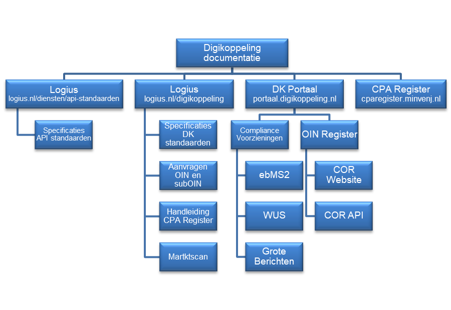

# Bijlage A: Bronnen 

Alle goedgekeurde Digikoppeling documenten zijn beschikbaar op https://www.logius.nl/diensten/digikoppeling/documentatie

### Digikoppeling-standaarden en gerelateerde documenten

| Documentnaam                                            | Auteur(s)              |
|---------------------------------------------------------|------------------------|
| Digikoppeling Architectuur                              | Logius Centrum voor Standaarden |
| Koppelvlakstandaard WUS                                 | Logius Centrum voor Standaarden |
| Koppelvlakstandaard ebMS2                               | Logius Centrum voor Standaarden |
| Koppelvlakstandaard Grote Berichten                     | Logius Centrum voor Standaarden |
| Beheermodel en releasebeleid Digikoppeling              | Logius Centrum voor Standaarden |
| Digikoppeling Beveiligingsstandaarden en voorschriften  | Logius Centrum voor Standaarden |
| Digikoppeling Identificatie en Authenticatie            | Logius Centrum voor Standaarden |
| Digikoppeling Actuele Documentatie en Compliance        | Logius Centrum voor Standaarden |
| Gebruik en achtergrond Digikoppeling certificaten       | Logius Centrum voor Standaarden |
| Best Practices WUS Digikoppeling                        | Logius Centrum voor Standaarden |
| Best Practices ebMS Digikoppeling                       | Logius Centrum voor Standaarden |
| Best Practice Grote Berichten                           | Logius Centrum voor Standaarden |

Tabel 6: Digikoppeling-standaarden en gerelateerde documenten

### Digikoppeling documentatie

#### Figuur 7: Digikoppeling documentatie

Overige Digikoppeling documentatie

| Documentnaam                                | Auteur(s)              | Status     |
|---------------------------------------------|------------------------|------------|
| Handleiding aansluiten                      | Logius                 | Definitief |
| Serviceniveau overeenkomst (SNO)            | Logius                 | Definitief |
| Aansluitvoorwaarden Digikoppeling           | Logius                 |            |
| Gebruikershandleiding Digikoppeling Portaal | Logius                 | Definitief |
| Handleiding CPA Register                    | Logius                 | Definitief |

Tabel 7: Overige Digikoppeling documentatie

### Overige geraadpleegde bronnen

| Documentnaam  | Versie     | Datum      | Auteur(s)  | Status|
|---------------|------------|------------|------------|-------|
| Architectuurschets van het stelsel voor gegevensuitwisseling | 1.0 | 17-06-2013 | W. Bakkeren, A. van Weel | Definitief |
| Verkorte versie Architectuurschets | 1.0        | 17-06-2013 | L. van der Knijff, W. Bakkeren, A. van Weel     | Definitief |
| Plan van Aanpak Doorontwikkeling Digikoppeling 3.0   | 1.0        | 25-2-2013  | L. van der Knijff | Definitief  |
| Digikoppeling Glossary Verklarende woordenlijst Digikoppeling documentatie    | 1.0  | 12-2-2013  | Wolfgang Ebbers Michael van Bekkum  | Definitief |
| Integratielaag LNV en Digikoppeling: Informatiesystemen koppelen via de DICTU-voorziening \[Handboek\]  | Definitief | Ntb        | Bert Dingemans Tom Peelen  Tony Nolde  Henk Vroemen | Definitief |
| Verfijning en herijking kosten- batenanalyse voor investeringen in gemeenschappelijke voorzieningen in het stelsel van basisregistraties: Grip op centrale en decentrale investeringen en kosten maximaliseert de businesscase [Business Case 2010] | Definitief | 23-2-2010  | Price Waterhouse Coopers   | Definitief                   |
| European Interoperability Framework (IDABC)    | 2.0        | 16-12-2010 | IDABC  | Annex 2 COM (2010) 744 final |
| NORA Principes en afgeleide principes          | Ntb        | Ntb        | Noraonline.nl   | Gepubliceerd  |
| NORA 3.0 Katern Strategie                      | 1.0        | 19-8-2009  | Noraonline.nl   | Gepubliceerd  |
| NORA 3.0 Knformatiebeveiliging, 2010           | 1.0        | 2010       | Noraonline.nl   | Gepubliceerd  |
| NORA 3.0 vording Principes voor samenwerking en dienstverlening   | Ntb  | 29-9-2010  | Jasper van Lieshout | Definitief  |
| NORA Beeldtaal | Ntb        | 13-11-2012 | ICTU  |                              |

Tabel 8: Overige geraadpleegde bronnen
