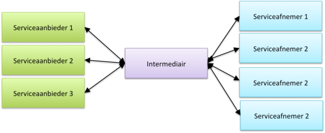
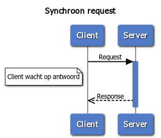
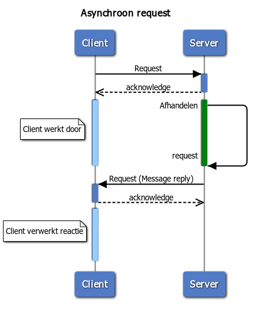
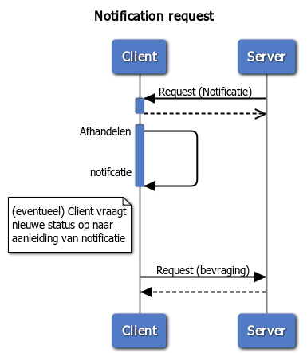
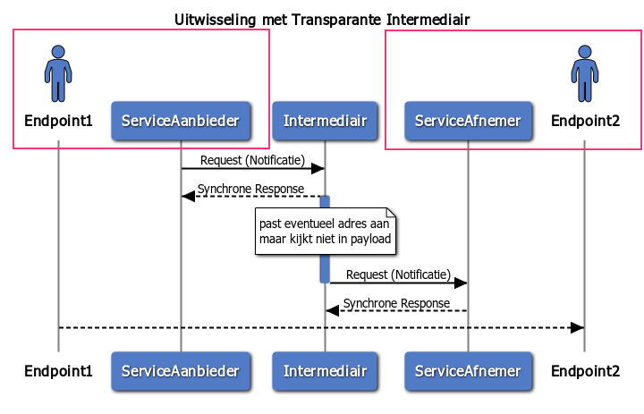
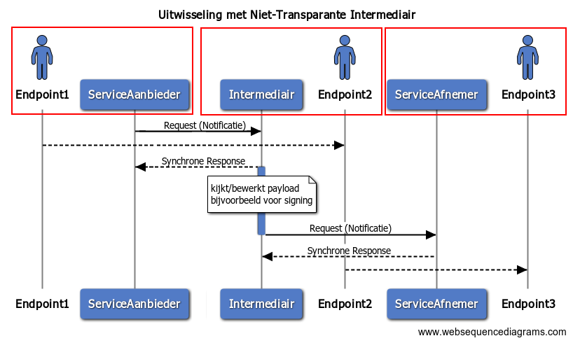

# De Digikoppeling-keten

Dit hoofdstuk beschrijft de Digikoppeling als bouwsteen van de Digitale Overheid. de keten van alle Digikoppeling-gerelateerde componenten die gegevensuitwisseling voor de Digitale Overheid invullen duiden we in dit document aan als de de Digikoppeling-keten. In dit hoofdstuk worden de vormen van gegevensuitwisseling op procesniveau beschreven.

## Digikoppeling als bouwsteen van de Digitale Overheid

De Nederlandse overheid werkt aan betere dienstverlening aan burgers en bedrijven met een basisinfrastructuur voor de Digitale Overheid die is gebaseerd op services zoals beschreven in de Nederlandse Overheids Referentie Architectuur (NORA). Een reden voor het gebruik van services is dat ze herbruikbaar en daardoor efficiënt zijn.

De basisinfrastructuur bestaat uit bouwstenen voor de dienstverlening aan burgers, aan bedrijven en de inrichting van de informatiehuishouding van de overheid zelf. De bouwstenen beslaan drie pijlers:

- Loketten en voorzieningen voor burgers.
- Loketten en voorzieningen voor bedrijven.
- Registraties in algemene zin, waaronder het stelsel van basisregistraties, inclusief voorzieningen zoals onder meer Digilevering (abonnementen services) en Digimelding (terugmelding van wijzigingen of fouten aan basisregistraties).

In dit document vatten we de loketten en voorzieningen voor burgers en bedrijven samen met het begrip ‘landelijke voorzieningen”. Om deze pijlers als samenhangend geheel te laten functioneren is het nodig dat zij informatie kunnen uitwisselen’.

Digikoppeling maakt het mogelijk om berichten uit te wisselen, databronnen te raadplegen en te bewerken en services aan te roepen en is daarmee een essentiële bouwsteen van de basisinfrastructuur van de Digitale Overheid. Organisaties kunnen via Digikoppeling rechtstreeks (bilateraal) gegevens met elkaar uitwisselen. Vaak zijn er extra schakels betrokken, zoals een sectoraal knooppunt of een intermediair.

Digikoppeling biedt een standaard voor het veilig uitwisselen van berichten en gegevens tussen systemen. Het is dus niet bedoeld om gegevens aan een eindgebruiker te tonen; dat gebeurt via een applicatie bij de eindgebruiker zelf. Digikoppeling standaardiseert de inrichting van gegevensuitwisseling zodat verschillende partijen veilig gegevens kunnen uitwisselen,.

## Opbouw van de Digikoppeling-keten

De Digikoppeling-keten bestaat uit:

- Deelnemende publieke organisaties die gegevens met elkaar uitwisselen (partijen). Een partij kan een service of resource aanbieden – in de rol van serviceaanbieder – of een service afnemen – in de rol van serviceafnemer.

- Intermediairs: organisaties die voor deze deelnemende organisaties bemiddelen in de uitwisseling van gegevens. Partijen maken onderling (of via een intermediair) afspraken over de inhoud en vorm van de gegevensuitwisseling.

- Componenten die de Digikoppeling-keten vormgeven.

### Partijen en Rollen

Een partij is een (publieke) organisatie die gegevensdiensten via Digikoppeling aanbiedt aan andere organisaties en/of afneemt van andere organisaties. Een partij (in de rol van serviceafnemer of serviceaanbieder) is tevens het eindpunt van de Digikoppeling-keten. Partijen maken onderling of via een intermediair afspraken over de samenwerking en over de gegevensuitwisseling.

De uitwisseling tussen een serviceaanbieder en een serviceafnemer moet altijd betrouwbaar/vertrouwd zijn, ondanks of dankzij de betrokkenheid van intermediairs.

### Intermediairs

Een intermediair is een organisatie die tussen twee (of meer) partijen berichten via Digikoppeling ontvangt en routeert. Een intermediair kan dienen als sectoraal knooppunt, waarbij de intermediair meerdere partijen in een samenwerkingsverband ontzorgt en ondersteunt.

Een intermediair vormt een schakel in de Digikoppeling-keten tussen serviceaanbieder en serviceafnemer:

- Een *transparante* intermediair stuurt berichten door naar het eindpunt (ontvanger) zonder de berichten te bewerken. Een transparante intermediair is zelf dus geen eindpunt in Digikoppeling[18](#f18). Het versleutelen van berichtinhoud (berichtenniveau versleuteling) kan worden toegepast indien de intermediair niet vertrouwd wordt.[19](#f19)

- Een *niet-transparante* intermediair (b.v. een sectoraal knooppunt) bewerkt berichten en is dus een eindpunt binnen Digikoppeling.

Een intermediair zoals een sectoraal knooppunt of SAAS leverancier kan in opdracht van partijen inhoudelijke bewerkingen op berichten uitvoeren zoals de integratie, conversie en distributie van gegevens. Een dergelijke ondersteunende rol kan partijen ontzorgen bij de implementatie van standaarden, het beheer van gedeelde/gezamenlijke voorzieningen en de afstemming tussen partijen op het gebied van gegevensuitwisseling.

Figuur 3: Positionering intermediair/sectoraal knooppunt

 <a name="f18"><dfn>18</dfn></a>: We beschouwen transparantie hier op de logistieke laag. Op technisch niveau is de intermediair een eindpunt omdat de TLS verbinding tussen twee servers moet worden opgezet.

 <a name="f19"><dfn>19</dfn></a>: Bericht-niveau versleuteling wordt op applicatieniveau toegepast tussen de verzender en ontvanger; de berichtinhoud wordt versleuteld zodat de intermediair alleen de headers kan lezen.

## End-to-end 

## Databewerker

## SAAS dienstverlener

## Componenten in de logistieke Digikoppeling-keten

De volgende componenten maken onderdeel uit van de Digikoppeling-keten van berichtuitwisseling.

| Componenten                            | Toelichting |
|----------------------------------------|----|
| Applicatie                             | Een systeem waarmee gegevens worden geproduceerd, vastgelegd en gebruikt.  |
| Broker of Enterprise Service Bus (ESB) | Een component waarmee berichten worden gegenereerd, aangeboden, afgenomen, gemonitord en verwerkt. Dit type systeem wordt gebruikt in de integratielaag. Een enterprise servicebus, broker of message handler zijn voorbeelden van een dergelijke component.                                                                                                              |
| Digikoppeling-adapter                  | Een software-adapter voor middleware systemen die door een ICT-leverancier wordt geleverd en die de Digikoppeling-koppelvlakstandaarden implementeert. De Digikoppeling-adapter handelt alle aspecten van de berichtverwerking af, inclusief de versleuteling/ontsleuteling, ondertekening etc. Een broker of ESB bevat vaak een (configureerbare) Digikoppeling adapter. |
| Gegevens                               | Informatie die wordt beheerd en opgeslagen. Gegevens worden voor een specifieke uitwisseling in een bericht geplaatst.                                                                                                                                                                                                          |
| PKIoverheid certificaten               | Identificatie en authenticatie vindt plaats op basis van het PKIoverheidscertificaat. Zie voor nadere uitleg Digikoppeling Identificatie en Authenticatie en Digikoppeling Gebruik en Achtergrond Certificaten.                                                                                                                            |
| Servicecontract                        | Een technisch formaat voor het vastleggen van afspraken over de inhoud van de gegevensuitwisseling tussen partijen. Een servicecontract wordt vormgegeven d.m.v. een CPA (voor ebMS2 services), OAS voor Restful APi's,   en een WSDL (voor WUS services) en wordt ingelezen in de Digikoppeling-adapter. voor de CPA stellen partijen samen een servicecontract op.|

Tabel 2: Componenten van de Digikoppeling-keten

N.B.: De Digikoppeling-voorzieningen (Het Digikoppeling portaal met de
Compliance Voorziening, het OIN register en het CPA register) vormen geen onderdeel van de Digikoppeling-keten maar ondersteunen tijdens de ontwikkel- en testfasen en bij het uitgifte en raadplegen van OIN's.

## Uitwisselingsvormen

Uitwisselingsvormen onderscheiden we op alle niveaus van inhoud, logistiek en transport.

1. De business heeft op inhoudelijk niveau behoefte aan specifieke uitwisselingsvormen. Dat zijn veel verschillende vormen die we in de volgende subparagraaf aan de hand van een tweetal kenmerken terugbrengen tot een viertal primitieve business-interacties.

2. op logistiek niveau biedt Digikoppeling een beperkt aantal patronen voor uitwisseling. De tweede subparagraaf licht deze patronen toe en geeft aan voor welke business-interactie deze toegepast moeten worden.

3. Op transport niveau is in Digikoppeling voorgeschreven welke vormen van uitwisseling (protocollen) toegepast worden. Deze worden hier niet behandeld.

### Business-behoefte

Op business-niveau is er een veelheid aan uitwisselingsvormen waaraan behoefte bestaat. Deze zijn vaak contextspecifiek. Soms zijn deze vormen ook specifiek voor een sector waardoor het loont om deze in een sectorale berichtstandaard voor de inhoud van een bericht af te spreken.

. Een aantal proceskenmerken op business-niveau bepaalt welke door Digikoppeling geboden logistieke vormen geschikt zijn. Zonder alle mogelijke behoeften uit te werken, behandelt deze sub-paragraaf wel de voor de keuze van Digikoppeling belangrijke kenmerken:

1. De impact op de serviceaanbieder is afhankelijk van de dienst die deze levert:

   - alleen informatie, die bevraagd kan worden; dat heeft geen impact op de aanbiedende organisatie;

   - het verwerken van een gevraagde transactie; dat heeft wel impact op de aanbiedende  organisatie.

2. Naast deze impact op de serviceverlenende organisatie kunnen we ook onderscheid maken naar de procesinrichting:

   - (het proces en) de applicatie van de afnemer wacht op een 'onmiddellijk' antwoord (de vraagsteller, applicatie/gebruiker houdt de context vast en weet dus direct waar het antwoord op slaat).

   - het resultaat is 'uitgesteld, komt enige tijd later (de applicatie moet dan het antwoord bij de vraag zoeken) of wellicht helemaal niet. De applicatie of het business proces wachten niet.

Op basis van deze twee verschillen komen we tot vier primitieve business-interacties, weergegeven in onderstaande tabel.

|                | **Onmiddellijk**                 | **Uitgesteld**                 |
|----------------|----------------------------------|--------------------------------|
| **Bevraging**  | Onmiddellijke businessbevraging  | Businessbevraging met uitstel  |
| **Transactie** | Onmiddellijke businesstransactie | Businesstransactie met uitstel |

Deze businessafspraken worden geïmplementeerd in (bedrijfs)applicaties.
Combineren van deze primitieve interacties tot meerdere (eventueel over de tijd verspreide interacties) maken complexe business-patronen mogelijk.

### Digikoppeling-aanbod

Digikoppeling onderscheidt verschillende vormen van uitwisseling:

- *synchrone* request-response voor bevraging en bewerking van objecten en in de context van het gebruik van *resources* op basis van het REST patroon.

- *synchrone* request-response met gestructureerde berichtuitwsseling

- *asynchrone* request-response en reliable messaging

- uitwisseling van grote data bestanden en hun metadata

Bij synchrone request-response voor bevraging en bewerking van objecten *data-providers* bieden providers databronnen - of resources-  die *data-consumers* kunnen bevragen en bewerken. Een provider vermeldt locatie van en randvoorwaarden voor toegang van de databron en via gestructureerde benadering kan een consumer de resource bevragen of zelfs bewerken.

Bij een synchrone request-response met gestructureerde berichtuitwsseling stuurt de service-requester een voorgedefinieerde vraag (request) aan de service-provider, die een antwoord (response) verstrekt. Het initiatief ligt bij de service-requester. Gaat er in de uitwisseling iets mis dan zal de service-requester na een bepaalde tijd de uitwisseling afbreken (time-out).

Bij een asynchrone request-response verstuurt de service-requester een bericht naar de ontvangende partij (ontvanger) en wacht op een (technische) ontvangstbevestiging. De verzendende (business) applicatie vertrouwt er op dat het bericht (betrouwbaar) afgeleverd wordt. De (business)applicatie zal niet wachten op het antwoord: deze applicatie zal het eventuele 'antwoordbericht' op een ander moment ontvangen en moeten correleren aan het oorspronkelijke vraag bericht.

### Synchrone uitwisseling

Digikoppeling biedt twee mogelijkheden voor synchrone uitwisseling aan: bij synchrone uitwisseling wacht het vragende informatiesysteem (de requestor) op een antwoord. Dit wachten heeft een beperkte duur (time-out). Als een (tijdig) antwoord uitblijft moet de vrager besluiten of hij de vraag opnieuw stelt of niet. De snelheid van afleveren is hier vaak belangrijker dan een betrouwbare aflevering.

Synchrone uitwisseling kunnen worden ingericht op basis van de Digikoppeling-koppelvlakstandaard WUS en het Digikoppeling Restful API profiel.

### Asynchrone uitwisseling

Een asynchroon verzoek is een enkelvoudig bericht waarop eventueel enige tijd later een retour-melding volgt. Het gebruikte protocol regelt de betrouwbare ontvangst en de onweerlegbaarheid (non-repudiation) van een bericht. Bij asynchrone uitwisseling is de betrouwbare aflevering van het bericht essentieel. Als een partij het bericht niet direct kan aannemen, voorzien de protocollen erin dat het bericht nogmaals wordt aangeboden.

Asynchrone uitwisseling kunnen worden ingericht op basis van de Digikoppeling-koppelvlakstandaard ebMS2.

### Geen onderscheid meer in gebruik WUS en ebMS2 voor bevragingen en transacties

De Provider bepaalt welk koppelvlak - Restful API, WUS of ebMS- van toepassing is op de door haar geleverde dienst.

Tot en met 2019 werd in de Digikoppeling Standaard onderscheid gemaakt tussen 'WUS voor bevragingen' en 'ebMS voor meldingen'. In de praktijk bleek dit onderscheid niet altijd goed te werken. Er zijn bijvoorbeeld usecases waarin WUS beter geschikt is voor meldingen. Binnen de overheidsorganisaties heeft het gebruik van REST-API's voor het uitwisselen van gegevens tussen overheden een enorme vlucht genomen. 

### Grote Berichten

De situatie kan zich voordoen dat een bericht een omvang krijgt die niet meer efficiënt door de Digikoppeling-adapters verwerkt kan worden bijvoorbeeld vanwege de overhead bij eventuele hertransmissies. Ook kan het voorkomen dat er behoefte bestaat aan het sturen van aanvullende informatie naar systemen buiten de normale procesgang ('out-of-band'). In die gevallen zal dit grote bestand op een andere wijze uitgewisseld moeten worden: met de Digikoppeling Koppelvlakstandaard Grote Berichten.

Bij ‘grote berichten’ worden grotere bestanden uitgewisseld via een Digikoppeling uitwisseling in combinatie met een (HTTPS-)down- of upload vanaf een beveiligde website. Grote berichten vormen een functionele uitbreiding op Digikoppeling uitwisseling voor de veilige bestandsoverdracht van berichten groter dan 20 MiB[24](#f24).

Digikoppeling Grote Berichten maakt verschillende vormen van uitwisseling op business-niveau mogelijk. De best-practice beschrijft de volgende vormen:

• Upload – grote hoeveelheid gegevens uploaden.

• Download – grote hoeveelheid gegevens downloaden.

• Selectie – een selectie van grote hoeveelheden gegevens verkrijgen.

• Verzending - grote hoeveelheid gegevens versturen.

• Multi-distributie - grote hoeveelheid gegevens aan meerdere ontvangers versturen.

 <a name="f24"><dfn>24</dfn></a>: **1 MiB**=1024\^2 bytes : Voorheen stond hier 20MB. We gebruiken de term MiB om geen enkele verwarring te scheppen over de drempelwaarde. Het verschil tussen 20Mb en 20Mib is echter te verwaarlozen.

## Overzicht transactiepatronen (nieuw)

### Synchrone bevraging

Bij een bevraging (vraag-antwoord) stuurt de service-requester een voorgedefinieerde vraag (request) aan de service-provider, die een antwoord (response) verstrekt. Het initiatief ligt bij de service-requester. Gaat er in de uitwisseling iets mis dan zal de service-requester na een bepaalde tijd de uitwisseling afbreken (time-out). Een synchrone bevraging is in de regel *idempotent*, een request kan opnieuw verstuurd worden zonder gevolgen. 

Figuur 4: Synchrone bevraging

|Koppelvlakspecificatie|Omschrijving|Praktijkvoorbeeld|
|---|---|---|
|Digikoppeling WUS| Digikoppeling WUS is geschikt als voor de bevraging gestructureerde  berichten (in XML) nodig zijn. Digikoppeling heeft profielen voor signing en encryption. |...|
|Digikoppeling REST-API| Digikoppeling REST-API heet een GET methode waarmee synchrone requests kunnen uitgevoerd. Digikoppeling REST-API kent nog geen gestandaardiseerde versies voor signing of encryptie| Bevragen OIN register via de COR API |

### Synchrone Melding-bevestiging

Bij een melding-bevestiging stuurt een service-requester informatie naar de service-provider en de ontvangst wordt synchroon door de service-provider bevestigd. Belangrijk is de schadelijke effecten te voorkomen als een bericht twee keer wordt verzonden (door een time-out) of als meldingen in de verkeerde volgorde binnenkomen. 

|Koppelvlakspecificatie|Omschrijving|Praktijkvoorbeeld|
|---|---|---|
|Digikoppeling WUS| Digikoppeling WUS is geschikt als voor de melding een  gestructureerde  bericht (in XML) nodig is. Digikoppeling heeft profielen voor signing en encryption. Voorwaarde is dat de melding *idempotent* is |...|
|Digikoppeling REST-API| Digikoppeling REST-API heet een PUT methode waarmee synchrone requests kunnen uitgevoerd. Digikoppeling REST-API kent nog geen gestandaardiseerde versies voor signing of encryptie Het Digikoppeling REST-API profiel kent ook een POST methode maar deze is niet idempotent en kan dus niet herhaaldelijk worden verzonden| ... |

### Asynchrone Melding-bevestiging

Bij een melding-bevestiging stuurt een service-requester informatie naar de service-provider en ontvangt synchroon een bevestiging dat een bericht is ontvangen. op een later moment kan de ontvanger een bericht sturen dat de melding is verwerkt  

Figuur 5: Asynchrone Melding-bevestiging

|Koppelvlakspecificatie|Omschrijving|Praktijkvoorbeeld|
|---|---|---|
|Digikoppeling ebMS2| Digikoppeling ebMS heeft reliable profiel (osb-rm) dat de bevestiging van ontvangst borgt | formele overdracht van OLO/DSO naar bevoegd gezag |
|Digikoppeling WUS| Digikoppeling WUS kent geen reliable profiel. Partijen in de keten moeten met elkaar afspraken hoe een melding wordt bevestigd in een antwoord door de ontvanger op een later tijdstip  |...|
|Digikoppeling REST-API| Digikoppeling REST-API heet een PUT en een POST methode waarmee synchrone requests kunnen uitgevoerd. Digikoppeling REST-API kent geen reliable profiel. Partijen in de keten moeten met elkaar afspraken hoe een melding wordt bevestigd in een antwoord door de ontvanger op een later tijdstip| ... |

### Overdracht van verantwoordelijkheid

Bij dit patroon gaat het om een overdracht van verantwoordelijkheden, zoals het bevoegd gezag -  bevoegd om besluiten te nemen over een onderwerp - van een overheidsorganisatie naar een andere organsatie. Hierbij is het essentieel dat beide partijen zekerheid over de de overdracht, omdat er bepaalde wettelijke termijnen kunnen bestaan waarin besluiten genomen moeten worden.  

|Koppelvlakspecificatie|Omschrijving|Praktijkvoorbeeld|
|---|---|---|
|Digikoppeling ebMS2| Digikoppeling ebMS kent een betrouwbaar profiel (osb-rm) dat de bevestiging van ontvangst borgt | formele overdracht van OLO/DSO naar bevoegd gezag |

### Uitwisselen grote bestanden

De situatie kan zich voordoen dat een bericht een omvang krijgt die niet meer efficiënt door de Digikoppeling-adapters verwerkt kan worden bijvoorbeeld vanwege de overhead bij eventuele hertransmissies. Ook kan het voorkomen dat er behoefte bestaat aan het sturen van aanvullende informatie naar systemen buiten de normale procesgang ('out-of-band').

|Koppelvlakspecificatie|Omschrijving|Praktijkvoorbeeld|
|---|---|---|
|Digikoppeling Grote berichten| Bij ‘grote berichten’ worden grotere bestanden uitgewisseld via een van de Digikoppeling profielen WUS, ebMS en REST-API in combinatie met een (HTTPS-)download vanaf een beveiligde website. Grote berichten vormen een functionele uitbreiding op de Digikoppelvlakstandaarden voor de veilige bestandsoverdracht van berichten groter dan xxx MiB/GiB | ... |

### Abonneren op wijzigingen middels notificaties

Dit patroon is bedoeld voor ketens die authentieke informatie willen 'halen bij de bron' in plaats van het synchroniseren van registraties. Hiervoor is het essentieel dat organisaties worden genotificeerd bij wijzigingen.

|Koppelvlakspecificatie|Omschrijving|Praktijkvoorbeeld|
|---|---|---|
|Digikoppeling ebMS|Digikoppeling ebMS heeft reliable profiel (osb-rm) dat de bevestiging van ontvangst borgt. Hiermee heeft de aanbiedende partij de zekerheid dat een notificatie door de ontvanger is ontvanger| Digilevering ontvangt gebeurtenisberichten van basisregistraties en zendt deze door naar geabonneerde overheidsorganisaties |
|Digikoppeling REST-API|  | VNG werkt afspraken voor decentrale notificatieservices |

## Uitwisseling via een transparante intermediair

Een transparante keten is alleen mogelijk als zowel de service-aanbieder als de serviceafnemer hetzelfde protocol hanteren. De intermediair routeert berichten tussen de serviceaanbieder en de serviceafnemer waarbij het bericht intact blijft (alleen de header wordt gelezen). De uitwisseling verloopt op dezelfde manier als bij een bilaterale uitwisseling.

Figuur 6: Transparante intermediair

|Koppelvlakspecificatie|Omschrijving|Praktijkvoorbeeld|
|---|---|---|
|Digikoppeling ...| [todo]| ... |

## Uitwisseling via een niet-transparante intermediair

Een transparante keten is alleen mogelijk als zowel de service-aanbieder als de serviceafnemer hetzelfde protocol hanteren. De intermediair routeert berichten tussen de serviceaanbieder en de serviceafnemer waarbij het bericht bewerkt moet worden voor verdere verzending. 

Figuur 7: Niet-Transparante intermediair

|Koppelvlakspecificatie|Omschrijving|Praktijkvoorbeeld|
|---|---|---|
|Digikoppeling ebMS |[todo]| (Rinis) |

 
<aside class="note">

> Bovenstaande patronen komen grotendeels uit de EDUkoppeling architectuur. 
> 
> EDUkoppeling beschrijft (in de *concept Architectuur 2.0*) de volgende patronen
>
> - **Request-response (bevraging)**
>   - een vraag waar direct een reactie op wordt verwacht
> - **Melding-bevestiging**
>   - De informatie wordt gestuurd door A en de ontvangst wordt synchroon door B bevestigd.
>   - (PH: Is dit een businesstransactie? Een patroon dat Digikoppeling niet kent (tot nu toe?)
>   - Belangrijk is de schadelijke effecten te voorkomen als een bericht twee keer wordt verzonden (door een time-out) of als meldingen in de verkeerde volgorde binnenkomen. Digikoppeling lost dat op met het patroon Gegarandeerde aflevering. Edukoppeling ondersteunt dat niet.
> - **Asynchrone uitwisseling**
>   - Een asynchrone uitwisseling is twee keer het patroon melding-bevestiging in verschillende richtingen.
> - **Grote berichten**
> - **Abonneren op wijzigingen middels notificaties**
>   - er is een verandering op gang van het synchroniseren van administraties naar het direct bevragen bij de bron.
> 
> EduKoppeling hanteert voor abonneren de volgende uitgangspunten:
>
> - Elke resource, elk object (verderop: gegevens) kent een beheerder; de organisatie die het gegeven in beheer heeft, en 1 of meer afnemers; de organisaties die deze resources gebruiken. In 1:n koppelvlakken is de centrale dienstverlener de houder van de gegevens, en zijn de gekoppelde organisaties de afnemers. In 1:1 situaties wordt een van beide partijen aangewezen als beheerder.
> - Updates op gegevens bij de beheerder worden geïnitieerd door de afnemer middels het patroon ‘Melding - bevestiging’ of ‘ Asynchrone uitwisseling’.
> - Ophalen van de actuele stand van zaken wordt altijd middels het request -response patroon gerealiseerd, niet door een melding vanuit de beheerder.
> - Wanneer een partij geïnteresseerd is in wijzigingen in een gegeven bij de beheerder kan hij dat kenbaar maken middels een abonnementenservice. Dit is een service die de beheerder moet leveren aan zijn afnemers.
>   - Bij een wijziging op een gegeven worden alle abonnees hiervan in kennis gesteld middels een notificatiebericht. Dus is altijd een “Melding - Bevestiging” met daarin alleen het unieke resourceID waarmee de abonnee, op het moment dat het hem uitkomt, de actuele stand kan ophalen. De gegevens zelf worden niet direct teruggeleverd. Hiermee wordt een maximale ontkoppeling gegarandeerd, ook bij wijzigingen in de toekomst.
>
> EDUkoppeling noemt ook een
>
> - Antipatroon: **Polling**

</aside>

