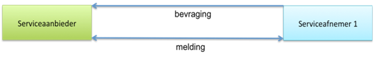
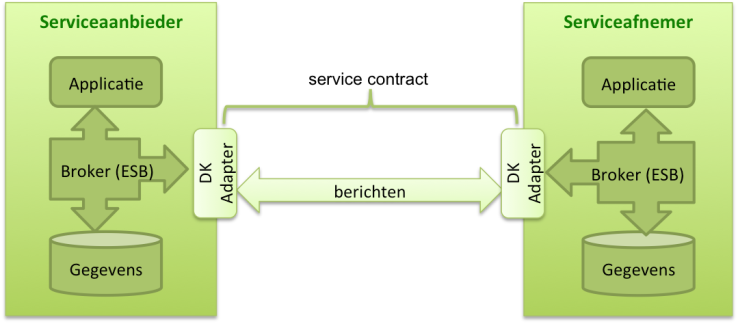
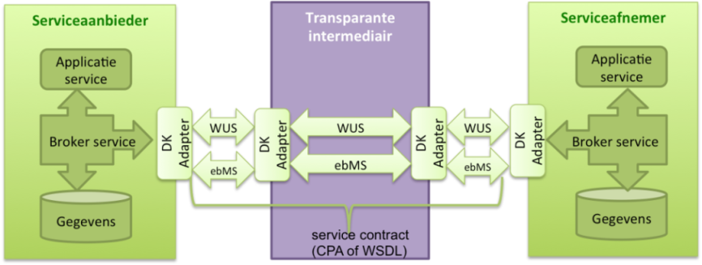

# De Digikoppeling-keten

# De Digikoppeling-keten

Dit hoofdstuk beschrijft de Digikoppeling als bouwsteen van de eOverheid. de keten van alle Digikoppeling-gerelateerde componenten die gegevensuitwisseling voor de eOverheid invullen duiden we in dit document aan als de de Digikoppeling-keten. In dit hoofdstuk worden de vormen van gegevensuitwisseling – `vraag/antwoord en meldingen `- op procesniveau beschreven.

## Digikoppeling als bouwsteen van de eOverheid

De Nederlandse overheid werkt aan betere dienstverlening aan burgers en bedrijven met een basisinfrastructuur voor de eOverheid die is gebaseerd op services zoals beschreven in de Nederlandse Overheids Referentie Architectuur (NORA). Een reden voor het gebruik van services is dat ze herbruikbaar en daardoor efficiënt zijn.

De basisinfrastructuur bestaat uit bouwstenen voor de dienstverlening aan burgers, aan bedrijven en de inrichting van de informatiehuishouding van de overheid zelf. De bouwstenen beslaan drie pijlers:

- Loketten en voorzieningen voor burgers.

- Loketten en voorzieningen voor bedrijven.

- Registraties in algemene zin, waaronder het stelsel van basisregistraties, inclusief voorzieningen zoals met onder meer Digilevering (abonnementen services) en Digimelding (terugmelding van wijzigingen of fouten aan basisregistraties).

In dit document vatten we de loketten en voorzieningen voor burgers en bedrijven samen met het begrip ‘landelijke voorzieningen”. Om deze pijlers als samenhangend geheel te laten functioneren is het nodig dat zij informatie kunnen uitwisselen’.

Digikoppeling maakt het mogelijk om berichten uit te wisselen en services aan te roepen en is daarmee een essentiële bouwsteen van de basisinfrastructuur van de eOverheid. Organisaties kunnen via Digikoppeling rechtstreeks (bilateraal) gegevens met elkaar uitwisselen. Vaak zijn er extra schakels betrokken, zoals een sectoraal knooppunt of een intermediair.

Digikoppeling biedt een standaard voor het uitwisselen van berichten tussen systemen. Het is dus niet bedoeld om gegevens aan een eindgebruiker te tonen; dat gebeurt via een applicatie bij de eindgebruiker zelf. Digikoppeling standaardiseert de inrichting van het berichtenverkeer zodat verschillende partijen berichten kunnen uitwisselen, ongeacht om welke gegevens het gaat.

## Opbouw van de Digikoppeling-keten

De Digikoppeling-keten bestaat uit:

- Deelnemende publieke organisaties die gegevens met elkaar uitwisselen (partijen). Een partij kan een service aanbieden – in de rol van serviceaanbieder – of een service afnemen – in de rol van serviceafnemer.

- Intermediairs: organisaties die voor deze deelnemende organisaties bemiddelen in de uitwisseling van gegevens. Partijen maken onderling (of via een intermediair) afspraken over de inhoud en vorm van de gegevensuitwisseling.

- Componenten die de Digikoppeling-keten vormgeven.

### Partijen

Een partij is een (publieke) organisatie die gegevensdiensten via Digikoppeling aanbiedt aan andere organisaties en/of afneemt van andere organisaties. Een partij (in de rol van serviceafnemer of serviceaanbieder) is tevens het eindpunt van de Digikoppeling-keten. Partijen maken onderling of via een intermediair afspraken over de samenwerking en over de gegevensuitwisseling.

De uitwisseling tussen een serviceaanbieder en een serviceafnemer moet altijd betrouwbaar/vertrouwd zijn, ondanks of dankzij de betrokkenheid van intermediairs.

### Intermediairs

Een intermediair is een organisatie die tussen twee (of meer) partijen berichten via Digikoppeling ontvangt en routeert. Een intermediair kan dienen als sectoraal knooppunt, waarbij de intermediair meerdere partijen in een samenwerkingsverband ontzorgt en ondersteunt.

Een intermediair vormt een schakel in de Digikoppeling-keten tussen serviceaanbieder en serviceafnemer:

- Een *transparante* intermediair stuurt berichten door naar het eindpunt (ontvanger) zonder de berichten te bewerken. Een transparante intermediair is zelf dus geen eindpunt in Digikoppeling[18](#f18). Het versleutelen van berichtinhoud (berichtenniveau versleuteling) kan worden toegepast indien de intermediair niet vertrouwd wordt.[19](#f19)

- Een *niet-transparante* intermediair (b.v. een sectoraal knooppunt) bewerkt berichten en is dus een eindpunt binnen Digikoppeling.

Een intermediair zoals een sectoraal knooppunt of SAAS leverancier kan in opdracht van partijen inhoudelijke bewerkingen op berichten uitvoeren zoals de integratie, conversie en distributie van gegevens. Een dergelijke ondersteunende rol kan partijen ontzorgen bij de implementatie van standaarden, het beheer van gedeelde/gezamenlijke voorzieningen en de afstemming tussen partijen op het gebied van gegevensuitwisseling.

Figuur 3: Positionering intermediair/sectoraal knooppunt

 <a name="f18"><dfn>18</dfn></a>: We beschouwen transparantie hier op de logistieke laag. Op technisch niveau is de intermediair een eindpunt omdat de TLS verbinding tussen twee servers moet worden opgezet.

 <a name="f19"><dfn>19</dfn></a>: Bericht-niveau versleuteling wordt op applicatieniveau toegepast tussen de verzender en ontvanger; de berichtinhoud wordt versleuteld zodat de intermediair alleen de headers kan lezen.

# Rollen: End-to-end, verwerker, intermediair, SAAS dienstverlener

`todo`

### Componenten in de logistieke Digikoppeling-keten

De volgende componenten maken onderdeel uit van de Digikoppeling-keten van berichtuitwisseling.

| Componenten                            | Toelichting |
|----------------------------------------|----|
| Applicatie                             | Een systeem waarmee gegevens worden geproduceerd, vastgelegd en gebruikt.  |
| Broker of Enterprise Service Bus (ESB) | Een component waarmee berichten worden gegenereerd, aangeboden, afgenomen, gemonitord en verwerkt. Dit type systeem wordt gebruikt in de integratielaag. Een enterprise servicebus, broker of message handler zijn voorbeelden van een dergelijke component.                                                                                                              |
| Digikoppeling-adapter                  | Een software-adapter voor middleware systemen die door een ICT-leverancier wordt geleverd en die de Digikoppeling-koppelvlakstandaarden implementeert. De Digikoppeling-adapter handelt alle aspecten van de berichtverwerking af, inclusief de versleuteling/ontsleuteling, ondertekening etc. Een broker of ESB bevat vaak een (configureerbare) Digikoppeling adapter. |
| Gegevens                               | Informatie die wordt beheerd en opgeslagen. Gegevens worden voor een specifieke uitwisseling in een bericht geplaatst.                                                                                                                                                                                                          |
| PKIoverheid certificaten               | Identificatie en authenticatie vindt plaats op basis van het PKIoverheidscertificaat. Zie voor nadere uitleg Digikoppeling Identificatie en Authenticatie en Gebruik van Digikoppeling Certificaten.                                                                                                                            |
| Servicecontract                        | Een technisch formaat voor het vastleggen van afspraken over de inhoud van de gegevensuitwisseling tussen partijen. Een servicecontract wordt vormgegeven d.m.v. een CPA (voor ebMS2 services) en een WSDL (voor WUS services) en wordt ingelezen in de Digikoppeling-adapter. Partijen stellen samen een servicecontract op.   |

Tabel 2: Componenten van de Digikoppeling-keten

N.B.: De Digikoppeling-voorzieningen (Het Digikoppeling portaal met de
Compliance Voorziening, het OIN register en het CPA register) vormen geen onderdeel van de Digikoppeling-keten maar ondersteunen alleen tijdens de ontwikkel- en testfasen.

## Uitwisselingsvormen

Uitwisselingsvormen onderscheiden we op alle niveaus van inhoud, logistiek en transport.

1. De business heeft op inhoudelijk niveau behoefte aan specifieke uitwisselingsvormen. Dat zijn veel verschillende vormen die we in de volgende subparagraaf aan de hand van een tweetal kenmerken terugbrengen tot een viertal primitieve business-interacties.

2. op logistiek niveau biedt Digikoppeling een beperkt aantal patronen voor uitwisseling. De tweede subparagraaf licht deze patronen toe en geeft aan voor welke business-interactie deze toegepast moeten worden.

3. Op transport niveau is in Digikoppeling voorgeschreven welke vormen van uitwisseling (protocollen) toegepast worden. Deze worden hier niet behandeld.

### Business-behoefte

Op business-niveau is er een veelheid aan uitwisselingsvormen waaraan behoefte bestaat. Deze zijn vaak contextspecifiek. Soms zijn deze vormen ook specifiek voor een sector waardoor het loont om deze in een sectorale berichtstandaard voor de inhoud van een bericht af te spreken (b.v. StUF, SuwiML en NEN3610). Een aantal proceskenmerken op business-niveau bepaalt welke door Digikoppeling geboden logistieke vormen geschikt zijn. Zonder alle mogelijke behoeften uit te werken, behandelt deze sub-paragraaf wel de voor de keuze van Digikoppeling belangrijke kenmerken:

1. De impact op de serviceaanbieder is afhankelijk van de dienst die deze levert:

- alleen informatie, die bevraagd kan worden; dat heeft geen impact op de aanbiedende organisatie;

- het verwerken van een gevraagde transactie; dat heeft wel impact op de aanbiedende organisatie.

1. Naast deze impact op de serviceverlenende organisatie kunnen we ook onderscheid maken naar de procesinrichting:

- (het proces en) de applicatie van de afnemer wacht op een 'onmiddellijk' antwoord (de vraagsteller, applicatie/gebruiker houdt de context vast en weet dus direct waar het antwoord op slaat).

- het resultaat is 'uitgesteld, komt enige tijd later (de applicatie moet dan het antwoord bij de vraag zoeken) of wellicht helemaal niet. De applicatie of het business proces wachten niet.

Op basis van deze twee verschillen komen we tot vier primitieve business-interacties, weergegeven in onderstaande tabel.

|                | **Onmiddellijk**                 | **Uitgesteld**                 |
|----------------|----------------------------------|--------------------------------|
| **Bevraging**  | Onmiddellijke businessbevraging  | Businessbevraging met uitstel  |
| **Transactie** | Onmiddellijke businesstransactie | Businesstransactie met uitstel |

Deze businessafspraken worden geïmplementeerd in (bedrijfs)applicaties.
Combineren van deze primitieve interacties tot meerdere (eventueel over de tijd verspreide interacties) maken complexe business-patronen mogelijk.

### Digikoppeling-aanbod

Digikoppeling onderscheidt twee hoofdvormen van uitwisseling:

- `bevraging (synchrone request-response)`

- `melding (asynchrone` request-response en  `reliable messaging)`

Bij een `bevraging` (vraag-antwoord) stuurt de service-requester een voorgedefinieerde vraag (request) aan de service-provider, die een antwoord (response) verstrekt. Het initiatief ligt bij de service-requester. Gaat er in de uitwisseling iets mis dan zal de service-requester na een bepaalde tijd de uitwisseling afbreken (time-out).

Bij een `melding` (betrouwbaar bericht) verstuurt de service-requester een betrouwbaar bericht (`melding`) naar de ontvangende partij (ontvanger) en wacht op een (technische) ontvangstbevestiging. De verzendende (business) applicatie vertrouwt er op dat het bericht (betrouwbaar) afgeleverd wordt. De (business)applicatie zal niet wachten op het antwoord: deze applicatie zal het eventuele 'antwoordbericht' op een ander moment ontvangen en moeten correleren aan het oorspronkelijke vraag bericht.`

### Invulling van de behoefte met het aanbod

Beide door Digikoppeling geboden uitwisselingsvormen moeten op de volgende wijze voor de eerder aangegeven vier primitieve business-interacties, toegepast worden.

|                | **Onmiddellijk**           | **Uitgesteld**        |
|----------------|----------------------------|-----------------------|
| **Bevraging**  | `Digikoppeling bevraging`    | Digikoppeling melding |
| **Transactie** | `Digikoppeling melding`[20](#f20) | Digikoppeling melding |

Uit bovenstaande tabel blijkt dat de `Digikoppeling bevraging` niet identiek is aan de `bevraging` op business-niveau en dat de `Digikoppeling melding` niet identiek is aan de `transactie` op business-niveau.`

  <a name="f20"><dfn>20</dfn></a>Soms kan ook een Digikoppeling 'bevraging' toegepast worden. Zie toelichting. 

**Onmiddellijke bevraging**  
In deze situatie wordt altijd een `Digikoppeling bevraging` toegepast. Het onmiddellijke karakter, direct een response die automatisch gerelateerd wordt aan het request, is hier doorslaggevend voor. De betrouwbaarheid van een Digikoppeling melding is niet nodig.

Een typische toepassing voor deze vorm is een gebruiker die via een online web-applicatie informatie opvraagt aan een achterliggend systeem; de koppeling tussen de web-applicatie en het achterliggende systeem vindt dan met een `Digikoppeling bevraging` plaats.`

**Uitgestelde bevraging**  
In deze situatie wordt altijd een `Digikoppeling melding` toegepast. Het uitgestelde karakter, een antwoord komt later en hoeft niet automatisch gerelateerd te worden aan de vraag, is hier doorslaggevend voor. De betrouwbaarheid van een Digikoppeling melding is weliswaar niet nodig maar kan hier ook geen ‘kwaad’.`

Een typische toepassing voor deze vorm is een business-applicatie die voor een interne (bijvoorbeeld batch) verwerking een actuele status uit een andere applicatie nodig heeft. De applicatie zal met andere verwerking verder gaan terwijl zolang geen antwoord ontvangen is. Een dergelijke situatie komt minder vaak voor.

**Onmiddellijke transactie**
In deze situatie wordt normaliter een `Digikoppeling melding` toegepast. De betrouwbaarheid van de `Digikoppeling melding` is hier bepalend. In bijzondere situaties kan betrouwbaarheid ook anders geregeld worden (zie hieronder) maar algemeen wordt dat afgeraden.

Een typische toepassing voor deze vorm is een gebruiker die via een online webapplicatie informatie aanpast en deze aanpassing moet met zekerheid in een achterliggende registratie afgehandeld worden (bijvoorbeeld uitvoeren van een bankoverschrijving[21](#f21)). De koppeling tussen de webapplicatie en de achterliggende registratie verloopt via een `Digikoppeling melding`.

Een uitzondering bestaat wanneer de service-requester dringend een response nodig heeft om verder te gaan. In dit geval geeft het onmiddellijke karakter de doorslag en zal betrouwbaarheid anders opgelost moeten worden. Aangeraden wordt echter om een andere proces-implementatie te kiezen[22](#f22).

Een typische toepassing voor deze vorm is een gebruiker die via een online web-applicatie informatie aanpast/toevoegt aan een achterliggende registratie en zekerheid moet hebben dat zijn input geaccepteerd wordt voordat hij verder kan[23](#f23). De koppeling tussen de web-applicatie en de achterliggende registratie verloopt via een `Digikoppeling bevraging`; de gebruiker zorgt voor de betrouwbaarheid door te bewaken dat er geen foutmelding optreedt en zonodig actie te nemen.

  <a name="f21"><dfn>21</dfn></a>: N.B. ; Merk op dat in dit voorbeeld afhandelen geen garantie geeft op verwerking als er een saldo-tekort is op het moment van uitvoeren.

 <a name="f22"><dfn>22</dfn></a>: Vaak kan ontkoppeld worden door onmiddellijk lokaal te registreren en de service-requester uitgesteld in de achterliggende registratie te laten verwerken. 

 <a name="f23"><dfn>23</dfn></a>: Vaak is deze afhankelijkheid van een achterliggende registratie ongewenst. Een andere vormgeving van het proces is mogelijk door invoer van gebruikers lokaal af te handelen en vervolgens off-line door te zetten naar een achterliggende registratie. 

**Uitgestelde transactie**  
`In deze situatie wordt Digikoppeling melding toegepast. Zowel de betrouwbaarheid als het uitgestelde karakter zijn hier bepalend.  
Een typische toepassing hiervoor is een batch-verwerkende applicatie die in een (andere) registratie veranderingen doorvoert.`

**Samenvatting**  
Een `Digikoppeling bevraging` is vooral geschikt als de (business) applicatie een onmiddellijke reactie nodig heeft. Een `Digikoppeling melding` is vooral geschikt voor uitgestelde verwerking en transacties.`

### Bevraging

`Digikoppeling bevragingen` zijn synchroon: het vragende informatiesysteem wacht op een antwoord. Dit wachten heeft een beperkte duur (time-out). Als een (tijdig) antwoord uitblijft moet de vrager besluiten of hij de vraag opnieuw stelt of niet. De snelheid van afleveren is hier vaak belangrijker dan een betrouwbare aflevering.`

<del> Bevragingen worden ingericht op basis van de Digikoppeling-koppelvlakstandaard WUS. </del>

### Melding (Transactie)

Een `melding` is een enkelvoudig bericht waarop eventueel enige tijd later een retour-melding volgt. Het gebruikte protocol regelt de betrouwbare ontvangst en de onweerlegbaarheid (non-repudiation) van een bericht. Bij meldingen is de betrouwbare aflevering van het bericht essentieel. Als een partij het bericht niet direct kan aannemen, voorzien de protocollen erin dat het bericht nogmaals wordt aangeboden.

<del> Meldingen kunnen worden ingericht op basis van de Digikoppeling-koppelvlakstandaard ebMS2. </del>

### Geen onderscheid in gebruik WUS en ebMS2 voor bevragingen en transacties

  
Waarom deze wijziging?

  > Dit is een voorstel voor nieuwe paragraaf, naar aanleiding van de ingediende 'RFC WUS voor meldingen'.

De Provider bepaalt welk koppelvlak - WUS of ebMS- van toepassing is op de door haar geleverde dienst. 

Tot 2019 werd in de Digikoppeling Standaard onderscheid gemaakt tussen 'WUS voor bevragingen' en 'ebMS voor meldingen'. In de praktijk bleek dit onderscheid niet altijd goed te werken. Er zijn usecases waarin WUS beter geschikt is voor meldingen. In afwachting van een grondige herziening in de loop van 2020 van het toepassingsgebied van Digikoppeling -  door de komst van koppelvlakken gebaseerd van (RESTful)API's- wordt deze aanpassing nu al doorgevoerd. 

### Grote Berichten

De situatie kan zich voordoen dat een bericht een omvang krijgt die niet meer efficiënt door de Digikoppeling-adapters verwerkt kan worden bijvoorbeeld vanwege de overhead bij eventuele hertransmissies. Ook kan het voorkomen dat er behoefte bestaat aan het sturen van aanvullende informatie naar systemen buiten de normale procesgang ('out-of-band'). In die gevallen zal dit grote bestand op een andere wijze uitgewisseld moeten worden: middels de Digikoppeling
Koppelvlakstandaard Grote Berichten.

Bij ‘grote berichten’ worden grotere bestanden uitgewisseld via een `melding of een bevraging` in combinatie met een (HTTPS-)download vanaf een beveiligde website. Grote berichten vormen een functionele uitbreiding op `bevragingen en meldingen` voor de veilige bestandsoverdracht van berichten groter dan 20 MiB[24](#f24).

Digikoppeling Grote Berichten maakt verschillende vormen van uitwisseling op business-niveau mogelijk. De best-practice beschrijft de volgende vormen:

• Upload – grote hoeveelheid gegevens uploaden.

• Download – grote hoeveelheid gegevens downloaden.

• Selectie – een selectie van grote hoeveelheden gegevens verkrijgen.

• Verzending - grote hoeveelheid gegevens versturen.

• Multi-distributie - grote hoeveelheid gegevens aan meerdere ontvangers versturen.

 <a name="f24"><dfn>24</dfn></a>: **1 MiB**=1024\^2 bytes : Voorheen stond hier 20MB. We gebruiken de term MiB om geen enkele verwarring te scheppen over de drempelwaarde. Het verschil tussen 20Mb en 20Mib is echter te verwaarlozen. 

## Overzicht transactiepatronen (nieuw)

`todo`

## Scenario’s ~~voor bevragingen en meldingen~~

### Overzicht bevragingen en meldingen

Bij `bevragingen` hanteren partijen dezelfde koppelvlakstandaard<del> (WUS`[25](#f25)`) </del> en bevragen elkaar rechtstreeks. Voor een bevraging moet de service op het moment van `bevraging` beschikbaar zijn.

Figuur 4: Digikoppeling-bevragingen en -meldingen

Een `melding` <del> (ebMS2) </del> wordt door de verzender verstuurd naar de ontvanger maar kan ook lopen via een transparante intermediair.`

Er zijn dus de volgende mogelijkheden:

- Bilaterale uitwisseling tussen partijen

- Bilaterale uitwisseling via een transparante intermediair

 <del> <a name="f25"><dfn>25</dfn></a> ebMS best effort mag binnen een sector worden gebruikt voor bevragingen (met een uitgesteld antwoord) indien partijen dit onderling overeenkomen. </del>

### Bilaterale uitwisseling tussen partijen

In het eenvoudigste patroon gebruiken de serviceaanbieder en serviceafnemer Digikoppeling rechtstreeks voor `bevragingen of meldingen`, eventueel in combinatie met grote berichten. Partijen stellen samen een (technisch) servicecontract op dat ingelezen kan worden in de eigen Digikoppeling- adapter.

Figuur 5: Bilaterale uitwisseling

### Bilaterale uitwisseling via een transparante intermediair

Een transparante keten is alleen mogelijk als zowel de service-aanbieder als de serviceafnemer hetzelfde protocol hanteren. De intermediair routeert berichten tussen de serviceaanbieder en de serviceafnemer waarbij het bericht intact blijft (alleen de header wordt gelezen). De uitwisseling verloopt op dezelfde manier als bij een bilaterale uitwisseling.

Figuur 6: Transparante intermediair