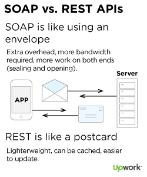

# Een nieuwe kijk op Digikoppeling

In dit hoofdstuk opzet beschrijven we de belangrijkste facetten van de nieuwe Digikoppeling Architectuur.

## Doel van Digikoppeling

(Overheids)organisaties willen diensten klantgericht, efficiënt, flexibel en rechtmatig aanbieden aan burgers en bedrijven. Daarvoor moeten zij gegevens en documenten op een generieke manier met elkaar kunnen uitwisselen.

Digikoppeling voorziet hierin door de standaarden voor deze uitwisseling te definiëren. Met deze logistieke standaardisatie bevordert Digikoppeling de interoperabiliteit tussen (overheids)organisaties.

## Van berichten naar gegevensuitwisseling

Digikoppeling heeft zich vanaf het begin van haar ontstaan gericht op het uitwisselen van berichten, en dan specifiek op op de 'envelop' van een bericht en  niet op de inhoud. Iedere organisatie die Digikoppeling gebruikt kon daarmee de postverzending onafhankelijk van de inhoud inrichten.

Met de toevoeging van het Digikoppeling Rest-API profiel komt de vergelijking met berichten in enveloppen in het gedrang.

 bron: [https://www.upwork.com/resources/soap-vs-rest-a-look-at-two-different-api-styles](https://www.upwork.com/resources/soap-vs-rest-a-look-at-two-different-api-styles)

Envelop en bericht schuiven in elkaar, de metafoor van enveloppen en postverzending werkt niet meer. Echter, het basisprincipe blijft: Digikoppeling bemoeit zich niet met de inhoud, Digikoppeling heeft *'Geen boodschap aan de boodschap'*.

<aside class="note">

> We moeten ook aandacht besteden aan het begrip *servicegerichte architectuur* van de NORA waarvoor Digikoppeling ooit een essentieel onderdeel vormde.
> 
> De servicegerichte architectuur is inmiddels door NORA naar het archief geplaatst en er bestaat nog geen opvolger.

</aside>

## Open en Closed Data 

Een belangrijke aanleiding voor het starten van de Commonground beweging van VNG was de ergernis over het op grote schaal rondpompen van gegevens binnen de digitale overheid. De ontsluiting van die gegevens en de noodzaak om die redundante bronnen synchroon te houden veroorzaakt een complex systeem van koppelingen. Een van de oplossingen voor het principe *Single Source of Truth* is om weer terug te gaan naar het concept van   'halen bij de bron', eigenlijk een van drijfveren van het ontstaan van het stelsel van basisregistraties.

Een concept dat sinds begin 2000 een opmars maakt is het principe van *Open Data*. Open Data zijn gegevens die in een open formaat door iedereen voor alle doeleinden vrij gebruikt, hergebruikt en gedeeld kunnen worden. De nadruk voor Open data ligt met name bij de gegevens van de overheid. Gegevens die om reden van privacy, veiligheid, wettelijke verplichtingen en dergelijk niet onder de definitie vallen noemen we in dit document Close Data.

## Open en Closed Diensten

Naast het onderscheid tussen Open en closed data kan je ook onderscheid maken in publieke en afgeschermde diensten. Voor closed data zal een overheidsorganisatie afgeschermde, beperkt toegankelijke closed diensten aanbieden.

Een overheidsorganisatie kan een bron van open data publiceert via een voor iedereen toegankelijke open dienst, en tegelijkertijd de dienst de toegang te  beschikbaar maken via een beperkt toegankelijke dienst, bijvoorbeeld met een uitgebreide beschikbaarheid, schaalbaarheid of functionaliteit.

- Open Diensten: diensten zonder toegangsbeperking bijvoorbeeld open data.
- Gesloten Diensten: diensten met toegangsbeperking bijvoorbeeld persoonsgegevens en vertrouwelijke gegevens of diensten voor specifieke partijen.

## Toepassingsgebied

Digikoppeling staat op de lijst *verplichte standaarden* van het Forum Standaardisatie De lijst beschrijft het toepassingsgebied van Digikoppeling als

> Digikoppeling moet worden toegepast op alle digitale gegevensuitwisseling met behulp van gestructureerde berichten die plaatsvindt met voorzieningen die onderdeel zijn van de GDI, waaronder de basisregistraties, of die sector-overstijgend is.

### Intern en Extern

Digikoppeling richt zich dus van oudsher primair op het uitwisselen van gegevens 'met behulp van gestructureerde berichten' en maakt (tot nu toe) geen duidelijk onderscheid tussen Open en Closed Data. Dit maakt het niet duidelijk wanneer Digikoppeling gebruikt moet worden. Reden om dit beter af te pellen en de scope van Digikoppeling eens langs een andere lat te leggen.

Digikoppeling is een standaard voor gegevensuitwisseling *tussen* organisaties, met voorzieningen die onderdeel zijn van de GDI, waaronder de basisregistraties, of die sector-overstijgend is.

### Open en Closed Data

Digikoppeling bestaat uit een set standaarden voor elektronisch verkeer tussen overheidsorganisaties. Digikoppeling gaat dus om overheidsgegevens. Openbare informatie van de Rijksoverheid mag worden hergebruikt, bijvoorbeeld op websites en in applicaties. Dit is Open Data.

Overheidsgegevens zijn actief beschikbaar als open data voor hergebruik van derden. Behalve als er goede redenen zijn om dat niet te doen. In dat geval noemen we dit Closed Data.

### Wie communiceert met wie

Digikoppeling gaat over communicatie tussen de overheden (G2G) en niet over uitwisseling met burgers (G2C). De communicatie tussen overheid en het bedrijfsleven (G2B) is niet gestandaardiseerd.

### Scope van Digikoppeling

Digikoppeling moet worden toegepast voor geautomatiseerde gegevensuitwisseling tussen informatiesystemen en is verplicht voor Nederlandse overheden (Rijk, provincies, gemeenten en waterschappen) en instellingen uit de (semi-)publieke sector.

<aside class="note">

**Digikoppeling moet worden toegepast wanneer niet-publieke gegevens - Closed Data -   worden uitgewisseld tussen overheden. `LET OP: Dit is voorstel voor een inperking van de huidige verplichting`**. Daarbuiten mag Digikoppeling worden toegepast, bestaande koppelvlakken die nu volgens de Digikoppeling standaard zijn ingericht blijven gewoon bestaan.

</aside>

### Grijs gebied

De verplichting voor Digikoppeling geldt dus voor communicatie tussen overheden. De praktijk is dat voor communicatie met bedrijven vaak verplichtingen gelden die hun oorsprong hebben in Digikoppeling, zoals het gebruik van het OIN en PKIoverheidscertificaten, of zelfs geïnspireerd zijn op Digikoppeling zoals het Koppelvlak WUS voor bedrijven van Digipoort.

