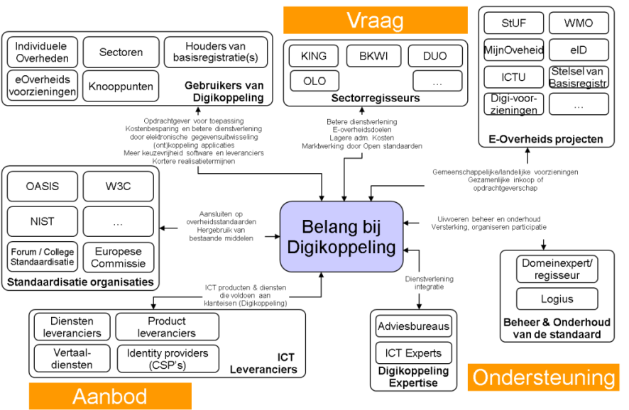

# Wat is Digikoppeling

Dit hoofdstuk geeft een overzicht van wat Digikoppeling inhoudt en hoe deze standaard wordt gebruikt binnen de Nederlandse overheid en publieke sector.

## Doel van Digikoppeling

(Overheids)organisaties willen diensten klantgericht, efficiënt, flexibel en rechtmatig aanbieden aan burgers en bedrijven. Daarvoor moeten zij gegevens en documenten op een generieke manier met elkaar kunnen uitwisselen.

Digikoppeling voorziet hierin door de standaarden voor deze uitwisseling te definiëren. Met deze logistieke standaardisatie bevordert Digikoppeling de interoperabiliteit tussen (overheids)organisaties. Digikoppeling heeft zich vanaf het begin van haar onstaan gericht zich op de 'envelop' van een bericht, niet op de inhoud. Daardoor kan iedere organisatie die Digikoppeling gebruikt, de postverzending onafhankelijk van de inhoud inrichten. Met de toevoeging van het Digikoppeling Rest-API profiel komt de metafoor met berichten in enveloppen wat in het gedrang, maar het basisprincipe blijft dat Digikoppeling zich niet met de inhoud bemoeit, *'Geen boodschap aan de boodschap'*.

 bron: [https://www.upwork.com/resources/soap-vs-rest-a-look-at-two-different-api-styles](https://www.upwork.com/resources/soap-vs-rest-a-look-at-two-different-api-styles)

Digikoppeling is primair bedoeld voor gegevensuitwisseling tussen systemen van overheidsorganisaties, in het bijzonder de basisregistraties en landelijke of intersectorale gegevensdiensten, maar wordt breder ingezet in de (semi)publieke sector. Digikoppeling is beschikbaar voor elke organisatie die veilig en betrouwbaar gegevens wil uitwisselen met andere organisaties in de publieke sector. Gebruik van Digikoppeling buiten de publieke sector is ook mogelijk.

<aside class="note">

> `TODO` De NORA richt zicht ook steeds meer op halen bij de bron en raadt het gebruik van API sterk aan.  Onderstaande alinea is daarom aan vervanging toe

</aside>

## ~~Servicegerichte architectuur conform NORA~~

<del>
Digikoppeling sluit aan bij de servicegerichte architectuur die NORA (Nederlandse Overheids Referentie Architectuur)[1](#f1): voorstaat. Deze vorm van informatie-uitwisseling verloopt via geautomatiseerde systemen van organisaties. Digikoppeling richt zich dus op de communicatie tussen ICT-systemen van verschillende organisaties, specifiek in de vorm van berichtenverkeer.</del>

<del>NORA 3.0 bestaat uit basisprincipes, afgeleide principes en katernen. Bijlage C geeft aan hoe Digikoppeling aansluit op de NORA-principes en welke NORA-principes met Digikoppeling worden ingevuld. Digikoppeling sluit ook aan op het NORA Katern Verbinden[2](#f2) en het NORA Katern Informatiebeveiliging.</del>

<del> <a name="f1"><dfn>1</dfn></a>: *Voor meer informatie over NORA zie [http://www.noraonline.nl](http://www.noraonline.nl)*

<a name="f2"><dfn>2</dfn></a>: In ontwikkeling.
</del>

## Scope van Digikoppeling

Om ~~digitale berichten~~ gegevens uit te wisselen moeten organisaties op verschillende niveaus afspraken maken:

- Over de inhoud en betekenis van berichten (payload en eventuele bijlagen): de structuur, semantiek, waardebereiken enzovoort.

- Over de logistiek (envelop): transportprotocollen (HTTP), messaging (SOAP), adressering, beveiliging (authenticatie en encryptie) en betrouwbaarheid.

- Over het transport (netwerk): de protocollen van de TCP/IP stack (TCP voor Transport, IP voor Netwerk) en de infrastructuur, bijvoorbeeld Diginetwerk of Internet.

- Over de informatie die beschikbaar is in de aan te bieden 'resources'

Digikoppeling richt zich op de logistieke laag van de ~~~bericht~~~gegevensuitwisseling in de publieke sector. Daarbij conformeert Digikoppeling zich aan de Nederlandse Overheid Referentie Architectuur (NORA) en het European Interoperability Framework.

De kaders van die logistieke laag zijn uitgewerkt in deze Digikoppeling Architectuur. De wijze waarop deze kaders worden toegepast en ingevuld zijn uitgewerkt in de Digikoppeling-koppelvlakstandaarden. De Digikoppeling-voorzieningen ondersteunen de implementatie van Digikoppeling: ze zijn bedoeld om koppelvlakken te testen, om organisaties te identificeren (OIN) en om (CPA-)contracten te registreren.

## De Digikoppeling standaard

Digikoppeling is gebaseerd op internationale open standaarden van OASIS en W3C, wereldwijde standaardisatie-organisaties voor open standaarden.

De Digikoppeling-standaard bestaat uit meerdere koppelvlakstandaarden. De koppelvlakstandaarden beschrijven de afspraken die nodig zijn om het berichtenverkeer tussen informatiesystemen mogelijk te maken.

Digikoppeling beschrijft vier verschillende, maar aanvullende, soms overlappende  koppelvlakstandaarden: ebMS2[3](#f3), WUS, REST-API[3a](#f3a) en Grote Berichten. In de Digikoppeling-documentatie zijn de koppelvlakstandaarden onafhankelijk van specifieke implementaties beschreven. Dat geeft organisaties de vrijheid om ICT-producten met een aansluiting op Digikoppeling te selecteren uit het aanbod van de markt of zelf iets te ontwikkelen.

<del>De keuze voor het gebruik van REST-API of de ebMS2 of WUS standaarden hangt onder meer af van het gewenste ~~berichtenverkeer~~~informatieuitwisseling ~~~bevragingen en/of meldingen)~~~, of er al gebruik wordt gemaakt van deze standaarden en welke standaarden door ketenpartners worden gebruikt.</del>

 <a name="f3"><dfn>3</dfn></a>: REST-API is geen standaard maar een Architectuurstijl. Eigenlijk had hier HTTP moeten staan.

 <a name="f3a"><dfn>3a</dfn></a>: ebMS2 verwijst naar de ebXML Message Service Specification 2.0, waarop het Digikoppeling ebMS profiel is gebaseerd. We hanteren in de Digikoppeling deze expliciete verwijzing naar versie 2 om elke verwarring met ebMS 3.0 en AS4 profielen te vermijden.

## Besparingen door Digikoppeling

In 2010 heeft PriceWaterhouseCoopers de meerwaarde onderzocht van de gemeenschappelijke stelselvoorzieningen die de verplichte uitwisseling van gegevens tussen bronhouder en afnemer uit 13 landelijke registraties ondersteunen*.*[4](#f4)

De business case stelde dat:

> *‘Met de ontwikkeling van gemeenschappelijke voorzieningen wordt redundantie in investeringen en kosten in het stelsel voorkomen doordat faciliteiten gemeenschappelijk worden ontwikkeld en toegepast. De baten van de businesscase zijn vermeden kosten en investeringen.’* [5](#f5)

Voor Digikoppeling is het geraamde netto voordeel[6](#f6) 560 miljoen euro over 10 jaar voor gebruik binnen het stelsel van basisregistraties. Het gebruik daarbuiten is nog groter.

Wanneer meer organisaties Digikoppeling gaan gebruiken, is de winst in termen van tijd, geld en snelheid voor alle partijen groter.

<a name="f4"><dfn>4</dfn></a>:  *Verfijning en herijking kosten- batenanalyse voor investeringen in gemeenschappelijke voorzieningen in het stelsel van basisregistraties: Grip op centrale en decentrale investeringen en kosten maximaliseert de businesscase, 23 februari 2010. Hierna “Business Case”, 2010*

 <a name="f5"><dfn>5</dfn></a>: Verfijning en herijking kosten- batenanalyse voor investeringen in gemeenschappelijke voorzieningen in het stelsel van basisregistraties: Grip op centrale en decentrale investeringen en kosten maximaliseert de businesscase, 23 februari 2010. Hierna “Business Case”, 2010.

 <a name="f6"><dfn>6</dfn></a>: Het netto voordeel bestaat uit de vermeden kosten en investeringen minus kosten en investeringen in Digikoppeling voor ontwikkeling, beheer en gebruik door aanbieders en afnemers.

## Toepassing van Digikoppeling

De toepassing van Digikoppeling heeft enkele grote voordelen:

- Organisaties die Digikoppeling implementeren, kunnen veilig digitaal ~~~berichten~~~gegevens uitwisselen met andere organisaties die ook Digikoppeling gebruiken[7](#f7).
 <a name="f7"><dfn>7</dfn></a>: *Expertadvies Digikoppeling v2.0, final, 13 februari 2013.*

<aside class="note">

> `TODO` is onderstaande nog het geval?

</aside>

- Met Digikoppeling kan een serviceaanbieder met één interface al zijn serviceafnemers bedienen. En een serviceafnemer kan met één interface alle serviceaanbieders bevragen.

- De implementatie van Digikoppeling (en de bijbehorende investering) is eenmalig. Na implementatie zijn nieuwe gegevensuitwisselingen met andere organisaties snel en tegen lagere kosten te realiseren.

- Digikoppeling is niet sectorgebonden: het kan door alle partijen gebruikt worden voor berichtuitwisseling tussen systemen.

- Compliancy aan de Digikoppeling standaarden kan door aanbieders en afnemers onafhankelijk worden aangetoond

### De ‘Pas toe of leg uit’-lijst

Digikoppeling staat op de ‘Pas toe of leg uit’-lijst van open standaarden van het Forum Standaardisatie[8](#f8). Welke koppelvlakken nodig zijn en welke standaarden uit de lijst ingezet moeten worden, is afhankelijk van de aan te schaffen functionaliteit[9](#f9).

<a name="f8"><dfn>8</dfn></a>: Voor meer informatie over open standaarden en de ‘pas toe of leg uit’ lijst zie: *[https://www.forumstandaardisatie.nl/open-standaarden](https://www.forumstandaardisatie.nl/open-standaarden)*.

 <a name="f9"><dfn>9</dfn></a>:  *Expertadvies Digikoppeling v2.0, final, 13 februari 2013*

De opname op de ‘Pas toe of leg uit’-lijst houdt in dat Digikoppeling de standaard is voor gegevensuitwisseling voor organisaties binnen het organisatorisch werkingsgebied (zie 2.6.3). Bij openbare aanbestedingen voor nieuwe systemen waarbij sprake is van berichtuitwisseling, moeten deze overheidsorganisaties Digikoppeling opnemen in het Programma van Eisen – of verantwoorden waarom zij dat niet doen. Opname op de ‘Pas toe of leg uit lijst’ is een middel om adoptie van open standaarden te bevorderen. Deze standaarden moeten voldoen aan de eisen zoals beschreven in bijlage D.

### Het functioneel toepassingsgebied

<aside class="note">

> De inhoud van deze paragraaf is gelijkgetrokken met het Functionale Toepassingsgebied van Digikoppeling op de Pas-toe-of-leg-uit lijst van het Forum Standaardisatie, zie [https://www.forumstandaardisatie.nl/standaard/digikoppeling)](https://www.forumstandaardisatie.nl/standaard/digikoppeling)

</aside>

Het functioneel toepassingsgebied van Digikoppeling is door OBDO als volgt gedefinieerd:

Digikoppeling moet worden toegepast op alle digitale gegevensuitwisseling met behulp van gestructureerde berichten die plaatsvindt met voorzieningen die onderdeel zijn van de GDI, waaronder de basisregistraties, of die sector-overstijgend is. Geautomatiseerde gegevensuitwisseling tussen informatiesystemen op basis van NEN3610 is uitgesloten van het functioneel toepassingsgebied.  

Op 24 mei 2018 is de omschrijving van het functioneel toepassingsgebied door het Overheidsbrede Beleidsoverleg Digitale Overheid (OBDO) opnieuw bekrachtigd.

<a name="f10"><dfn>10</dfn></a>: [https://lijsten.forumstandaardisatie.nl/open-standaarden/digikoppeling](https://lijsten.forumstandaardisatie.nl/open-standaarden/digikoppeling)

### Het organisatorisch werkingsgebied

<aside class="note">

> De inhoud van deze paragraaf is gelijkgetrokken met het Organisatorische Werkingsgebied van Digikoppeling op de Pas-toe-of-leg-uit lijst van het Forum Standaardisatie, zie [https://www.forumstandaardisatie.nl/standaard/digikoppeling)](https://www.forumstandaardisatie.nl/standaard/digikoppeling)

</aside>

Het organisatorisch werkingsgebied van Digikoppeling is door het OBDO gedefinieerd als:

- Nederlandse overheden (Rijk, provincies, gemeenten en waterschappen) en instellingen
- uit de (semi-) publieke sector.

Digikoppeling is van toepassing bij aanschaf of ontwikkeling van systemen bedoeld voor gestructureerde berichtenuitwisseling met voorzieningen die onderdeel zijn van de GDI (zoals de basisregistraties) en berichtverkeer dat sectoroverstijgend is.

Uitgezonderd zijn: de uitwisseling van Geo-informatie (daarvoor bestaat NEN3610) en de gevallen waarin de aanbieder van gegevens vaststelt dat geen noodzaak bestaat om de afnemer van de gegevens te authenticeren.

### Toepassing binnen sectoren of buiten de overheid

Digikoppeling kan door alle (publieke en private) organisaties worden toegepast die onderling gegevens willen uitwisselen. Een verplichting geldt alleen voor het hierboven genoemde organisatorisch werkingsgebied, dus voor de uitwisseling met basisregistraties en intersectoraal verkeer. Het gebruik van Digikoppeling buiten het organisatorisch werkingsgebied gebeurt dus altijd in overleg en in samenwerking met de betrokken uitwisselingspartners.

## Ontwikkeling van Digikoppeling

### Digikoppeling 1.0 en 1.1

Digikoppeling is ontstaan uit de behoefte van overheidsorganisaties om eenduidig en veilig onderling gegevens uit te kunnen wisselen. Het standaardiseren van de logistieke laag voor services was een randvoorwaarde om een servicegerichte architectuur conform NORA te realiseren. Versie 1.0 van Digikoppeling richtte zich alleen op uitwisseling tussen overheidsorganisaties.

In 2007 voegde het Forum en College Standaardisatie Digikoppeling 1.0 toe aan de
‘Pas toe of leg uit’-lijst van standaarden. Versie 1.1 is in 2009 opgenomen op die lijst.

### Digikoppeling 2.0

Digikoppeling 2.0 maakte het mogelijk om een bericht te beveiligen (te ondertekenen en versleutelen) en om bijlagen toe te voegen. Daarnaast introduceerde Digikoppeling 2.0 een koppelvlakstandaard voor het uitwisselen van grote berichten.

Versie 2.0 is ‘backwards compatible’: organisaties die versie 1.0 gebruiken kunnen blijven communiceren met partijen die werken met nieuwere versies van de standaard. De nieuwe functionaliteiten zijn uiteraard niet beschikbaar in versie 1.0.

Digikoppeling 2.0 is in 2013 door het College Standaardisatie opgenomen op de
‘Pas toe of leg uit’-lijst van standaarden. Omdat versie 2.0 backwards compatible is, voldoen implementaties van Digikoppeling 1.0 nog steeds aan die lijst.

### Vanaf 2018: Digikoppeling versionering niet meer of hoofdniveau, maar op documentniveau

Voor de Digikoppeling standaard is in 2018 de versionering op het hoofdniveau beëindigd. Er zal alleen nog worden gerefereerd aan de Digikoppeling standaard en de versionering van de verschillende onderdelen wordt op documentniveau bijgehouden.

## Digikoppeling-beheeromgeving

Het Digikoppeling-beheermodel waarborgt dat de Digikoppeling-standaarden niet alleen onderhouden worden, maar ook meegroeien met de behoeften van haar gebruikers. Het *Digikoppeling Beheermodel en Releasebeleid* geeft hier invulling aan.

Veel verschillende partijen hebben direct of indirect belang bij de ontwikkeling, de implementatie en het gebruik van de Digikoppeling-standaarden.

De Digikoppeling-standaarden worden in stand gehouden en doorontwikkeld door de participatie van de belanghebbenden. We onderscheiden daarbij drie posities: de vraagkant, de aanbodkant en de ondersteuningskant.

- Aan de *vraagkant* staan de gebruikers: organisaties die Digikoppeling gebruiken voor de eigen informatievoorziening, sectoren die Digikoppeling gebruiken als standaard voor (keten)integratiedoeleinden en e-overheidsvoorzieningen die Digikoppeling toepassen.

- Aan de *aanbodkant* staan ICT-leveranciers die de producten maken waarmee Digikoppeling kan worden gerealiseerd (leveranciers van Digikoppeling adapters of Digikoppeling diensten, SAAS-leveranciers). Ook standaardisatie-organisaties (OASIS, W3C e.d.) rekenen we tot de aanbodkant.

- Aan de *ondersteuningskant* staan de beheerders van de Digikoppeling-standaarden en de Digikoppeling-voorzieningen en Digikoppeling expertise (zowel uit de markt als binnen de overheid).

Een bijzondere groep vormen sectorale knooppunten (zie Hoofdstuk 3). Zij staan vaak niet alleen aan de vraagkant (als gebruiker en/of vertegenwoordiger van hun achterban), maar bieden ook ondersteuning als zij partijen in hun samenwerkingsverband ontzorgen.

Figuur 2: De Digikoppeling-beheeromgeving van vraag, aanbod en ondersteuning

Hieronder staan de belangrijkste onderdelen van de beheeromgeving.

- De gebruikers van Digikoppeling, die samenkomen in:
  - Het Technisch Overleg Digikoppeling, waarin voorgestelde wijzigingen worden afgestemd.
  - Een openbare community (op ~~Pleio~~Github) voor het uitwisselen van kennis en het voeren van een bredere discussie over de wijze van samenwerken en het uitwisselen van gegevens via Digikoppeling.
  - <del>Het Afnemersoverleg, het formele orgaan dat besluiten neemt over stelselvoorzieningen. Naast Afnemersoverleg kunnen besluiten ook nog worden voorgelegd aan de Regieraad Gegevens .Bijeenkomsten met leveranciers en gebruikers.
</del>  
  - De beheerorganisatie, ondergebracht bij Logius, die de standaarden en voorzieningen beheert, ontwikkelingen in de omgeving volgt en periodiek voorstellen ter doorontwikkeling uitwerkt.
  - Standaardisatieprocessen en -organen (onder andere het Forum en OBDO).
 
Het hele beheerproces staat beschreven in het *Digikoppeling Beheermodel en Releasebeleid.*

De Digikoppeling-beheerder is verantwoordelijk voor het opstellen en beheren van overheidsbrede standaarden en afspraken over het gebruik van Digikoppeling en voor het beheren van de Digikoppeling-voorzieningen.
